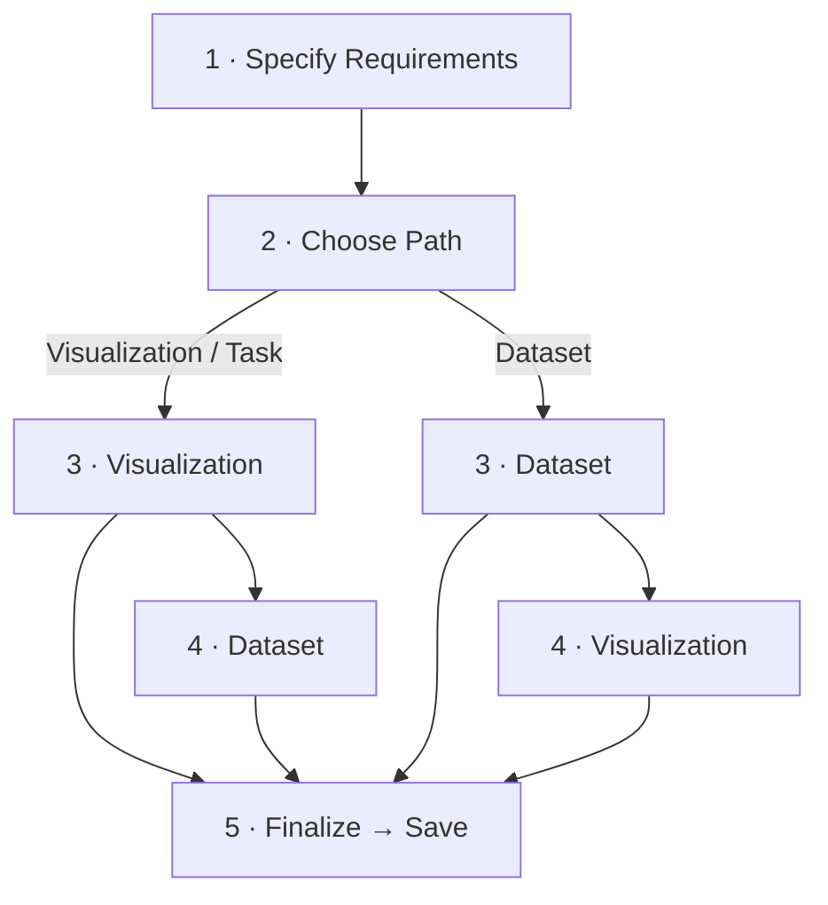
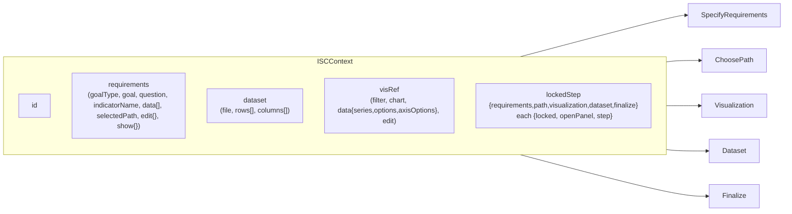
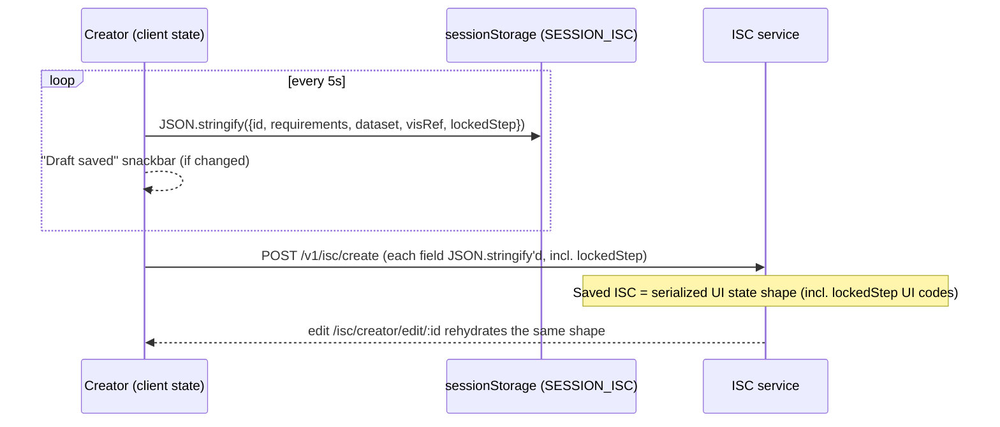
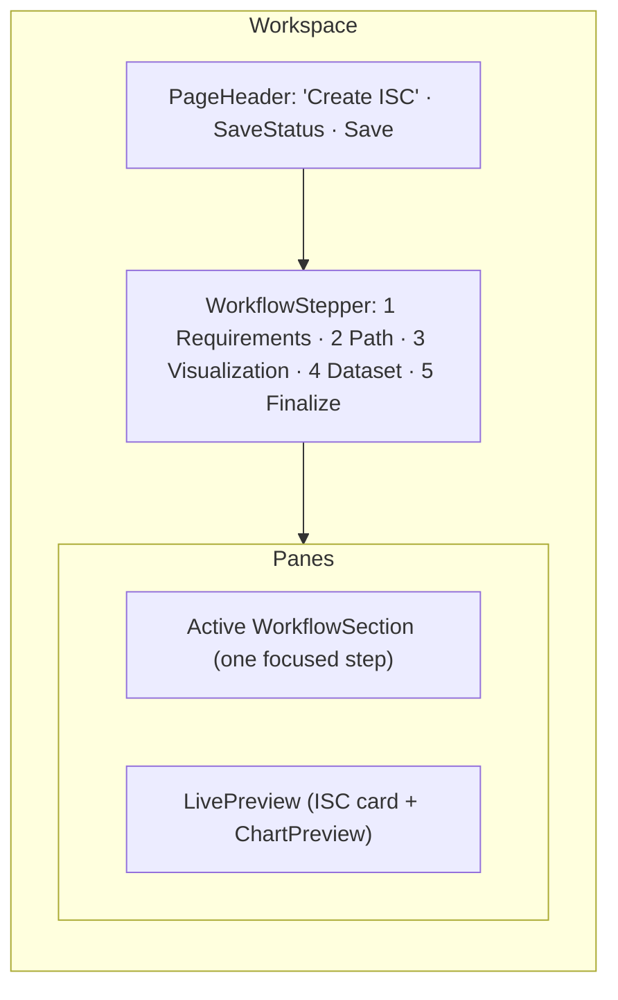
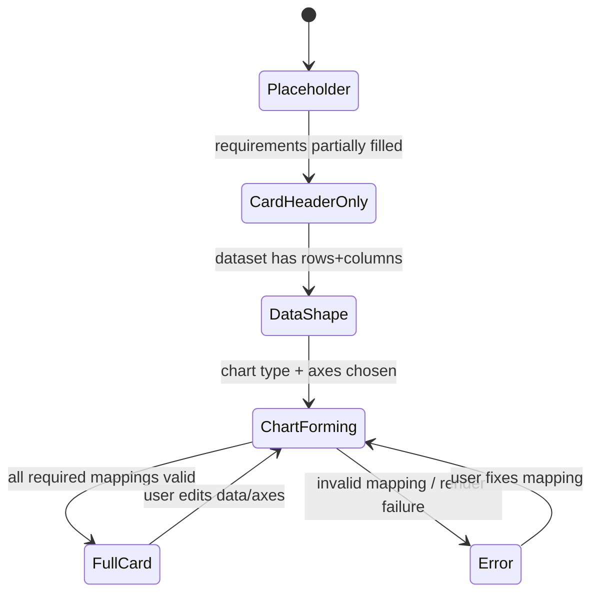
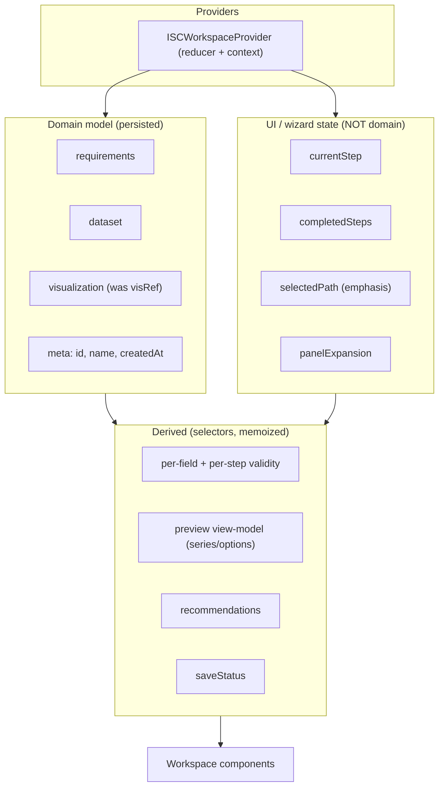
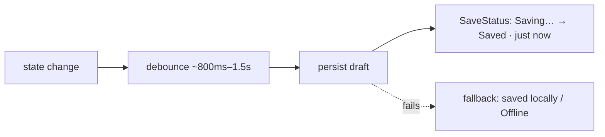
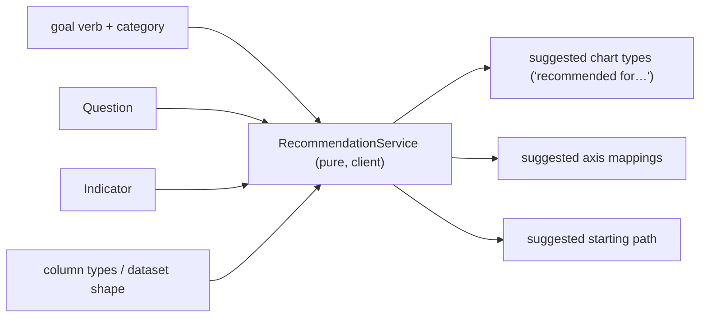

# ISC Creator — Architecture & Product Blueprint

> **Status:** design blueprint. No code changes accompany this document.
> **Audience:** designers + frontend architects implementing the next-generation
> ISC Creator across phased PRs.
> **Companion doc:** [`UI_ARCHITECTURE.md`](./UI_ARCHITECTURE.md) (shell, theme, primitives,
> conventions). This document is the ISC‑Creator‑specific deepening of that foundation.
>
> **Prime directive:** ISC Creator is the **flagship feature** and encodes a **research
> contribution** (the Goal → Question → Indicator → Data → Visualization model). We are
> redesigning **how it is presented**, never **the conceptual model**. The five phases stay.

---

## Table of contents
1. [Product Vision](#1-product-vision)
2. [Current Architecture](#2-current-architecture)
3. [Current UX Analysis](#3-current-ux-analysis)
4. [Product Principles](#4-product-principles)
5. [Target Workflow](#5-target-workflow)
6. [Workspace Architecture](#6-workspace-architecture)
7. [Preview Architecture](#7-preview-architecture)
8. [Path Selection (redesigned)](#8-path-selection-redesigned)
9. [State Architecture](#9-state-architecture)
10. [Component Architecture](#10-component-architecture)
11. [Validation Strategy](#11-validation-strategy)
12. [Autosave Strategy](#12-autosave-strategy)
13. [Recommendation Engine](#13-recommendation-engine)
14. [Accessibility](#14-accessibility)
15. [Implementation Roadmap](#15-implementation-roadmap)
16. [Risks](#16-risks)

---

## 1. Product Vision

### What ISC Creator is
A **no‑code, guided authoring tool** that turns a researcher's *intent* into a saved,
reusable **Indicator Specification Card** — a specification of *what* to measure, over
*what data*, shown as *what visualization*. It is **pedagogical**: it teaches the
OpenLAP way of thinking about learning analytics (Goal → Question → Indicator → Data →
Visualization) while producing an artifact.

### Who it is for
- **Primary users — Learning Analytics researchers & educators** who are *not*
  programmers: instructors, instructional designers, education researchers who know
  their pedagogical goal but not query languages or charting libraries.
- **Secondary users —** advanced OpenLAP users prototyping quickly; workshop/teaching
  contexts (the guided flow is itself a teaching aid); and future template authors.

### The problem it solves
Most analytics tools start at "pick a chart / write a query" — which assumes the user
already knows the answer. ISC Creator starts at "**what do you want to achieve?**" and
scaffolds the user from a fuzzy goal to a concrete, shareable indicator, lowering the
barrier from *programming* to *thinking clearly about a question*.

### Why it differs from the Indicator Editor
| | **ISC Creator** | **Indicator Editor** |
|---|---|---|
| Audience | Beginners / researchers (no‑code) | Power users working on **real LRS data** |
| Input data | A **specified/sample dataset** (manual or CSV) used to *prototype* the card | Live xAPI/LRS statements |
| Purpose | **Specify & teach** the indicator concept; prototype a visualization | **Analyze** real data and produce production indicators |
| Output | An **Indicator Specification Card** (the spec + a prototype chart) | A computed indicator from real data |
| Mental model | "Design the idea" | "Run the analysis" |

ISC Creator is the **on‑ramp and design surface**; the Indicator Editor is the
**execution engine**. Keeping that distinction crisp is a product invariant.

---

## 2. Current Architecture

### 2.1 Current workflow (five phases)
1. **Specify Requirements** — guided, progressive reveal: **Goal** (pick from a
   backend goal catalog or write a custom goal; a goal has a *verb* + *category*) →
   **Question** → **Indicator name + Data columns** (named fields, each with a data type).
2. **Choose Path** — three cards: **Visualization**, **Dataset**, **Task** (Task currently
   behaves like Visualization). The choice **reorders** the next two phases.
3. **Choose Visualization** — pick a chart type + filter; map axes.
4. **Choose Dataset** — build/upload the dataset (data‑grid manager, CSV import).
5. **Finalize Indicator** — live chart preview + customization panel → name & **Save**.



### 2.2 Current component hierarchy
```
indicator-specification-card.jsx        # orchestrator + ISCContext + autosave + step gating
├─ <Breadcrumbs> (hand-rolled)
├─ SpecifyRequirements
│  ├─ RequirementSummary
│  ├─ SpecifyGoal / ConfirmGoal      (GoalList, TipPopover, custom goal entry)
│  ├─ FormulateQuestion / ConfirmQuestion
│  └─ SpecifyIndicator (DataList: columns + types)
├─ ChoosePath
│  ├─ ChoosePathSummary
│  └─ PathSelectors                  (3 clickable Paper "cards": vis/data/task)
├─ Visualization                     (rendered conditionally by step code)
│  ├─ ChartTypeFilter / VisualizationFilter (VisSelection, VisualizationDescription)
│  └─ VisualizationSummary
├─ Dataset                           (rendered conditionally by step code)
│  ├─ DataTableManager (DataGrid: column-menu rename/retype/delete, CSV importer, dialogs)
│  └─ DatasetSummary
└─ Finalize
   ├─ FinalizeSummary
   ├─ VisSelection (chart preview) + CustomizationPanel (elements/filters/styles tabs)
   └─ NameDialog → save
```

### 2.3 State, contexts, reducers, hooks
- **One context** — `ISCContext` provides five `useState` objects + setters:
  `id`, `requirements`, `dataset`, `visRef`, `lockedStep`.
- **No reducers** — all updates are ad‑hoc `setX(p => …)` spread updates across many
  child components.
- **No custom hooks** — logic lives inline in components and the orchestrator.
- **`lockedStep`** is the de‑facto state machine: per phase
  `{ locked: bool, openPanel: bool, step: "0".."5" }`. The `step` **string code** doubles
  as *ordering* **and** *visibility*; the orchestrator renders Visualization/Dataset via
  duplicated `step === "3"/"4"` checks.



### 2.4 Dialogs
`NameDialog` (save), CSV `ImportDialog`/`CsvImporter`, `AddColumnDialog`/`AddRowDialog`,
column‑menu rename/change‑type/delete dialogs. Help is delivered via `TipPopover`.

### 2.5 Services & recommendations
- `requestAllGoals(api)` → `GET /v1/analytics/goals` — the **goal catalog** (verbs/
  categories) that seeds Step 1.
- `requestCreateISC` → `POST /v1/isc/create`; `requestUpdateISC` → `PUT /v1/isc/{id}`.
- **Recommendations:** none today beyond the goal catalog — chart/axis/type choices are
  fully manual.

### 2.6 Persistence (important constraint)

**Consequence:** the **wire/storage format is the UI state shape**, including UI‑only
`lockedStep`. Editing an existing ISC rehydrates that exact structure. Any state redesign
must therefore ship a **serialization adapter** (read legacy → internal model → write a
compatible/versioned payload). This is the single biggest constraint on the rebuild.

---

## 3. Current UX Analysis

### Dimension‑by‑dimension
- **Workflow** — strong conceptual model, but the **Path fork** (with a no‑op "Task"
  door) and the resulting **phase reordering** mean two users get two sequences, hurting
  learnability.
- **Cognitive load** — one long scroll of stacked panels that grey out (`opacity .5 +
  pointerEvents:none`); the user mentally tracks lock state and "what's next" with no map.
- **Discoverability** — progression hinges on finding a bottom‑of‑panel **"Next"**;
  locked panels don't say how to unlock; key meaning hides in **hover tooltips** (bad on
  touch/keyboard).
- **Information hierarchy** — flat, same‑weight `Paper`s; no primary‑action emphasis;
  hand‑rolled breadcrumb (inconsistent with the modernized `PageHeader`).
- **Progression** — implicit (panels appear/disappear) rather than an explicit clickable
  stepper; revisiting an earlier phase means scrolling + re‑expanding.
- **Validation** — **binary & silent**: the Next/Save button is disabled until everything
  is valid, with **no field‑level explanation** of what's missing.
- **Navigation** — no canonical "you are here"; can't jump steps.
- **Preview** — **only at Finalize**; researchers can't see the card forming while they
  work.
- **Autosave** — `sessionStorage` only (lost on tab close, not cross‑device, not in "My
  ISCs"), with a **snackbar every 5 s** — fragile *and* noisy.
- **Accessibility** — disabled‑by‑opacity isn't accessible; clickable `Paper`s; tooltip‑
  only meaning; no stepper landmark / `aria-current`.
- **Error handling** — save errors throw `error.response`; little inline recovery.

### What is good (keep the spirit)
- The **Goal → Question → Indicator** scaffold with inline examples (`TipPopover`) and a
  **goal catalog + custom goals**. This is the research contribution and the teaching value.
- **Summaries**: completed phases collapse to a summary line — a good instinct to preserve.
- Rich **data‑grid** editing and a **broad chart library** already exist.

### What should never change
- The **five conceptual phases** and their meaning.
- The **goal verb/category model** and custom goals (a research construct).
- The Path concept's **pedagogical intent** (different entry mental models).
- The **save artifact's semantics** (a specifiable, reloadable card).

### What should change
- Presentation: linear **persistent stepper**, one expanded section, completed→summary,
  future→preview.
- **Path** becomes guidance (descriptions/recommendations/examples), not a silent
  reorder + a no‑op door.
- **Live preview** becomes first‑class.
- **Inline validation** replaces silent gating.
- **Trustworthy, quiet autosave**; eventually server drafts.
- **State**: a single typed model + reducer + serialization adapter (decouple UI from
  storage).

---

## 4. Product Principles

1. **Research‑first** — the conceptual model is sacred; UI serves it, never flattens it.
2. **Progressive disclosure** — one focused task at a time; reveal complexity as earned.
3. **Beginner‑friendly / no‑code** — plain language, examples, defaults; never assume
   technical knowledge.
4. **Immediate feedback** — show the card forming live; validate inline as the user types.
5. **Trustworthy** — work is never lost; status is always honest and visible.
6. **Explainability** — every choice (path, chart, type) explains *why* and *when to use it*.
7. **Low cognitive load** — a persistent map (stepper), calm surfaces, summaries for done work.
8. **Accessibility first** — keyboard, screen‑reader, reduced‑motion as defaults.
9. **Consistency** — reuse the design system (`PageHeader`, theme tokens, `EmptyState`,
   error helpers) and behave like the rest of the modernized app.
10. **Guided, not constraining** — beginners get a guided spine; power users can jump steps
    and use templates.

---

## 5. Target Workflow

**Keep all five phases.** Change the interaction model to a **persistent linear stepper
with a two‑pane workspace** and a **live preview**. The Path phase is preserved as an
explicit, *explained* step (Section 8), not removed.

### Interaction model
- A **persistent stepper** (top or left) shows all five phases, current position
  (`aria-current="step"`), and completion state. Steps are **clickable once reachable**.
- **Only one section is expanded** (the active step) in the main editor pane.
- **Completed sections collapse to summaries** (the existing good instinct, formalized)
  and remain editable via the stepper or an "Edit" affordance.
- **Future sections** are represented in the stepper (and optionally as **preview
  placeholders**), not as greyed, scary, disabled panels.
- The **live preview pane** shows the ISC/chart taking shape from the moment there's
  enough data.



### Phase‑by‑phase
1. **Requirements** — keep guided Goal→Question→Indicator+Data with inline help/examples
   and **inline validation**. Preview shows a forming "card header" (goal/question/name).
2. **Path** — an *explained* choice (Section 8) that sets a **recommended ordering**
   without hiding meaning or silently reordering in a confusing way.
3. **Visualization** — a **gallery** with descriptions + "recommended for…" badges driven
   by the data shape; **preview updates live** as chart/axes change.
4. **Dataset** — the data‑grid workspace (manual / CSV / sample), with the **preview
   reflecting the data** immediately.
5. **Finalize** — full card preview, name/describe, Save/Update; clear success → lands in
   "My ISCs".

> **Ordering note:** the *canonical dependency* is Requirements → Data → Visualization →
> Finalize (a chart needs data). The **Path** step lets a user *start their thinking* from
> Visualization, Dataset, or Task, but the stepper still presents a coherent, consistent
> order; "Path" pre‑selects emphasis and defaults rather than producing two divergent UIs.

---

## 6. Workspace Architecture

Design ISC Creator as a **workspace** (à la Linear/Figma/GitHub Actions): a stable frame
with a progress rail, a focused editor, a live artifact, and persistent global actions.

```
┌───────────────────────────────────────────────────────────────────────┐
│ TOP BAR (PageHeader)                                                    │
│  Breadcrumb · "Create an ISC"            [SaveStatus: ✓ Saved] [Save ▾] │
├───────────────────────────────────────────────────────────────────────┤
│ STEPPER  1 Requirements ─ 2 Path ─ 3 Visualization ─ 4 Dataset ─ 5 Fin. │
├──────────────────────────────────────┬────────────────────────────────┤
│ MAIN EDITOR (active step)            │ LIVE PREVIEW                    │
│  StepHeader (title + help)           │  ISC card header (goal/Q/name)  │
│  …focused inputs for this step…      │  ChartPreview / DatasetPreview  │
│  RecommendationPanel / HintCard      │  placeholder · loading · error  │
│  ValidationPanel (what's missing)    │                                 │
├──────────────────────────────────────┴────────────────────────────────┤
│ BOTTOM ACTIONS:  [Back]                         [Save draft]  [Next →]  │
└───────────────────────────────────────────────────────────────────────┘
```

- **Top area** — `PageHeader` (title + breadcrumb) with global **SaveStatus** and the
  primary Save/Update action.
- **Stepper** — persistent progress + navigation; horizontal on desktop, condensed on
  mobile (e.g., "Step 2 of 5" + a dropdown).
- **Main editor** — the single active `WorkflowSection`; uses `StepHeader`, the step's
  inputs, `HintCard`/`RecommendationPanel`, and `ValidationPanel`.
- **Live preview** — always present from the moment data exists; collapsible on small
  screens (tab/drawer) so the editor stays usable on mobile.
- **Bottom actions** — `Back` / `Next` for linear flow + an explicit **Save draft**;
  `Next` is enabled when the step is valid and *says why* when not.
- **Autosave status** — a quiet inline `SaveStatus` ("Saved · just now"), never a snackbar
  per tick.

**Layout requirement:** this is the **full‑bleed editor layout variant** noted as debt in
`UI_ARCHITECTURE.md` §18 — the workspace should opt out of the standard content‑sheet
padding so the two‑pane workspace can use the full width.

**Responsive:** desktop = side‑by‑side editor/preview; tablet = preview collapsible;
mobile = single column with the preview as a toggle/drawer and a condensed stepper.

---

## 7. Preview Architecture

Preview becomes **first‑class** — the artifact the user is building, visible while building.

### What renders
- **LivePreview** = the **ISC card** (header: goal/question/indicator name) + the
  **ChartPreview** (the selected visualization) + a compact **DatasetPreview** (shape:
  rows×cols, column types) when relevant.

### When it appears & how it updates

- Updates **reactively** from the state model (debounced for expensive renders), so any
  edit to requirements/data/axes reflects immediately.
- **Placeholder state** — friendly "Your indicator will appear here" with a hint of what's
  needed next (reuse `EmptyState`).
- **Loading state** — skeleton chart while data/series compute.
- **Error state** — inline, explainable ("Select an X and Y axis to render this chart"),
  never a blank/broken canvas. Distinguish *not‑enough‑input* (guidance) from
  *render‑failure* (error).

### Tradeoff
Live preview adds render cost and partial‑state handling. Mitigate with **debounce**,
**memoized series derivation**, and a **pure preview component** that accepts a normalized
view‑model (so it can't crash the editor). Alternative considered — "preview on demand"
(a button) — rejected: it undercuts the core value (immediate feedback) for researchers.

---

## 8. Path Selection (redesigned)

**Keep the Path concept** — it has real pedagogical value (it meets users at their
*starting mental model*). Fix the *presentation* and the *consequences*.

### Reframe
"**Where would you like to start?**" — not three identical boxes, but three **explained
entry points**, each with an icon, a one‑line description, an example, and a
"**recommended for…**" line. The choice sets **emphasis + smart defaults + suggested order**,
and the stepper still keeps a coherent flow.

| Entry | Icon | "Recommended for…" | Example | What it does |
|---|---|---|---|---|
| **Visualization‑first** | chart | "I know roughly how the chart should look." | "A bar chart of downloads per material." | Surfaces the visualization gallery early; pre‑emphasizes chart selection, then asks for matching data. |
| **Dataset‑first** | table | "I know what my data looks like." | "I have a CSV of activity per student." | Opens the dataset workspace early; recommends chart types from the data shape. |
| **Task‑first** | target | "I know my analytical task/why, not the format yet." | "I want to compare engagement across weeks." | Uses the goal/question/task to **recommend** both a chart and a dataset shape. *(This is the door that must stop being a no‑op — it should drive recommendations.)* |

### Presentation requirements
- **Not three bare boxes** — use the card pattern with: title, icon, description,
  **example**, and a **"Recommended for…"** caption visible without hover.
- **Recommendations** — based on the goal verb/category chosen in Step 1 (e.g., a "compare"
  goal → suggest grouped/stacked bar; a "monitor over time" goal → suggest line), the
  selected path can highlight a recommended chart and a recommended dataset shape.
- **Real buttons / selectable cards** — not clickable `div`/`Paper`; keyboard‑selectable
  with a clear selected state and `aria-pressed`/radio semantics.
- **Reversible & non‑destructive** — changing path re‑emphasizes, but must **not silently
  wipe** prior work without confirmation.

> Net effect: Path becomes a *teaching moment with guidance* rather than a confusing fork.

---

## 9. State Architecture

### Goals
Decouple **domain state** from **UI/wizard state**, replace ad‑hoc `setState` spreads with
a **typed reducer**, derive everything derivable, and **isolate persistence** behind an
adapter that preserves the legacy wire format.

### Proposed shape


### Decisions
- **Single reducer** (`iscReducer`) over the domain model with explicit, named actions
  (`SET_GOAL`, `ADD_DATA_COLUMN`, `SET_CHART_TYPE`, `MAP_AXIS`, …). One place to reason
  about transitions; testable in isolation.
- **Separate wizard slice** — `currentStep`, `completedSteps`, `selectedPath`,
  expansion — **derived/UI only**, *not* part of the research artifact. (This is the fix
  for `lockedStep`'s string codes leaking into storage.)
- **Derived state via selectors** — validation, preview view‑model, recommendations, and
  save status are **computed**, never stored. Memoize expensive ones (preview series).
- **Component state** stays local for ephemeral UI (a dialog's open flag, a text field's
  focus) — not in the reducer.
- **Persistence adapter** — `serializeISC(model) ↔ deserializeISC(payload)` maps the
  internal model to/from the **existing JSON wire format**. Introduce a `schemaVersion`;
  when reading a legacy payload (which embeds `lockedStep`), the adapter derives wizard
  state and ignores/normalizes UI‑only fields. **Backward compatibility is mandatory** —
  existing saved ISCs must still open.
- **Autosave & validation & recommendations** are **services/hooks** layered on the
  reducer (Sections 11–13), not tangled into components.

### Tradeoffs / alternatives
- **Reducer vs. multiple `useState`** — reducer chosen for testability and to tame the
  cross‑component update sprawl. Cost: more upfront structure.
- **Zustand/Redux vs. `useReducer`+context** — start with `useReducer`+context (no new
  dep, matches the codebase). Revisit a store only if preview/recompute perf demands it.
- **One context vs. split contexts** — optionally split **domain** vs **wizard/preview**
  contexts so preview re‑renders don't re‑render editor inputs unnecessarily.

---

## 10. Component Architecture

> Responsibilities only — **no implementation**. Names are proposals.

```
ISCWorkspace                      # full-bleed layout shell for the creator
├─ PageHeader                     # (shared) title + breadcrumb + SaveStatus + Save
├─ WorkflowStepper                # persistent 5-step progress + navigation (a11y stepper)
├─ <main> editor pane
│  └─ WorkflowSection             # the single active step container
│     ├─ StepHeader               # step title, description, contextual help (TipPopover)
│     ├─ (step body — see below)
│     ├─ RecommendationPanel      # "recommended for…" suggestions for this step
│     ├─ HintCard                 # inline guidance / examples
│     └─ ValidationPanel          # what's required / what's missing (non-blocking)
├─ <aside> preview pane
│  └─ LivePreview                 # ISC card frame
│     ├─ ChartPreview             # pure chart renderer (view-model in)
│     └─ DatasetPreview           # data shape summary
└─ WorkspaceFooter                # Back / Save draft / Next
```

**Step bodies (one per phase):**
- **RequirementEditor** — Goal/Question/Indicator+Data guided flow (wraps existing
  SpecifyGoal/Question/Indicator behavior).
- **PathSelector** — the redesigned explained entry points (Section 8).
- **VisualizationGallery** — chart gallery with descriptions + "recommended for…" +
  axis mapping.
- **DatasetWorkspace** — the data‑grid manager (manual / CSV / sample), column types.
- **FinalizeWorkspace** — full preview + name/describe + Save/Update.

**Cross‑cutting / reusable:**
- **WorkflowSummary** — collapsed read‑only summary of a completed step (with Edit).
- **SaveStatus** — quiet autosave indicator ("Saving…", "Saved · just now", "Offline —
  saved locally").
- **RecommendationPanel / HintCard / ValidationPanel** — generic enough to reuse across
  steps.
- Reuse from the design system: `PageHeader`, `EmptyState` (preview placeholders/errors),
  `MetadataChip` (dataset/preview facts), theme tokens, the `api-errors` helpers.

**Why this shape:** each step body is independently testable and swappable; the workspace
frame is stable; preview and validation are decoupled from inputs; summaries make the
linear flow revisitable without scroll‑hunting.

---

## 11. Validation Strategy

**Layered, inline, explainable — never silent.**


- **Field‑level** — validate on change/blur with `helperText`/`error` (e.g., "Goal is
  required", "Every column needs a name and type"). Reuse the form‑error patterns from
  Account Settings.
- **Step‑level** — a derived `isStepValid(step)` powers the stepper (a step shows
  complete/incomplete) and the **Next** button. When `Next` is disabled, a
  **ValidationPanel** lists exactly what's missing (replacing today's silent disabled
  button).
- **Global** — `canSave` = all required steps valid; the Save action explains the first
  blocking step if not.
- **Backend remains authoritative** — on Save, map `ApiErrorResponse.details.fieldErrors`
  back onto fields via the existing `mapFieldErrors` helper.
- **Buttons:** `Next`/`Save` are **enabled by validity**, and always **explain** the
  blocker (tooltip + ValidationPanel) — never a dead, unexplained disabled state.

**Principle:** don't block typing; do block *advancing/saving* — and always say why.

---

## 12. Autosave Strategy

Replace the 5‑second interval + snackbar with **quiet, debounced, honest** autosave.



- **Subtle status, not spam** — a single `SaveStatus` chip in the header: `Saving…` →
  `Saved · just now` → relative time. **No per‑tick snackbar.**
- **Debounced on change** (not a blind interval); coalesce rapid edits.
- **Local draft (now)** — keep a local draft (prefer `localStorage` keyed by draft id so
  it survives tab close, an improvement over `sessionStorage`), with explicit **recovery**
  on reopen ("Resume your draft?").
- **Server draft (future)** — a `Draft` status persisted via the ISC service so drafts
  appear in "My ISCs" and sync across devices; the persistence adapter already gives us the
  serialization seam to do this cleanly.
- **Recovery** — on load, if a local/server draft exists, offer resume vs. start fresh;
  never silently overwrite.

---

## 13. Recommendation Engine

Turn the tool from a form into a **guided assistant**. Today only the goal catalog exists;
build a small, explainable recommendation layer.



- **Inputs** — goal verb/category (e.g., *compare*, *monitor*, *predict*), question,
  indicator, and **data types/shape** (categorical vs numeric vs temporal, cardinality).
- **Outputs** — recommended chart types (with reasons), default axis mappings, and a
  recommended starting path.
- **Where the logic lives** — a **pure, testable client module** (`recommendation/` —
  rules/heuristics first; e.g., "temporal x + numeric y → line", "one categorical + one
  numeric → bar"). Keep it **explainable** ("Recommended because your data has a time
  column"). Surface via `RecommendationPanel`.
- **Future** — server‑side or model‑driven suggestions (using the goal taxonomy and
  corpus of existing ISCs) behind the same interface; the client rules become the
  fallback. Keep recommendations **advisory** — never auto‑apply without user intent.

---

## 14. Accessibility

- **Keyboard** — full keyboard path through every step; logical focus order; focus moves
  to the new step's `StepHeader` on navigation; no keyboard traps in the data grid/dialogs.
- **Stepper** — an accessible stepper (`aria-current="step"`, each step a real
  button/link with name + state "completed/current/upcoming"); arrow/tab navigation.
- **Forms** — labels on every input; `helperText`/`error` for validation; `ValidationPanel`
  associated via `aria-describedby`; the data grid follows MUI a11y guidance.
- **Preview** — preview is supplementary, not focus‑stealing; provide a text/`aria-label`
  summary of the chart ("Bar chart: downloads per material") so it's not opaque to screen
  readers; placeholder/error states are real text.
- **Dialogs** — MUI `Dialog` (focus trap, Esc, labelled titles); return focus to the
  trigger on close.
- **Screen readers** — announce step changes and save status politely (`aria-live`
  "polite" for SaveStatus; not chatty).
- **Reduced motion** — honor `prefers-reduced-motion` for step transitions, preview
  updates, and any reveal (consistent with the app motion system).
- **No clickable divs** — path cards and selectable tiles are real controls.

---

## 15. Implementation Roadmap

Sequenced so each phase is **independently shippable**, **low‑risk**, and **preserves
behavior** until intentionally replaced. Early phases are *internal* (no visible change);
visible redesign lands only once the scaffolding is proven.

| Phase | Scope | Why here |
|---|---|---|
| **A — Internal architecture** | Introduce the typed model + `iscReducer` + selectors + **serialization adapter** (read/write legacy format, `schemaVersion`), behind the existing UI. No visual change. | De‑risks everything else; guarantees saved ISCs keep working before any UI moves. |
| **B — Workspace layout** | `ISCWorkspace` shell + **full‑bleed layout variant** + `PageHeader` + footer actions; host the existing steps inside it. | Establishes the frame without touching step internals. |
| **C — Stepper** | `WorkflowStepper` + `WorkflowSection`/`WorkflowSummary` (one expanded, completed→summary), replacing `lockedStep` string codes with wizard state. | Fixes navigation/progression; unlocks the rest. |
| **D — Step 1 Requirements** | Wrap/port Goal→Question→Indicator+Data into `RequirementEditor` with inline validation + hints. | Highest‑value teaching step; validates the new patterns on familiar content. |
| **E — Step 2 Path** | Redesigned `PathSelector` (explained entries, recommendations, a11y), make "Task" drive recommendations. | Depends on Step 1's goal data for recommendations. |
| **F — Step 3 Visualization** | `VisualizationGallery` (descriptions + "recommended for…") + axis mapping. | Needs the recommendation seam (E) and feeds preview (I). |
| **G — Step 4 Dataset** | `DatasetWorkspace` (reuse the data grid; manual/CSV/sample) themed + validated. | Independent; pairs with preview. |
| **H — Step 5 Finalize** | `FinalizeWorkspace`: full preview + name/describe + Save/Update + backend error mapping. | Closes the loop. |
| **I — Preview** | Promote `LivePreview`/`ChartPreview`/`DatasetPreview` to first‑class, wired to selectors (placeholder/loading/error). | Can progress in parallel once the model (A) exists; biggest UX payoff. |
| **J — Autosave** | Debounced quiet autosave + `SaveStatus` + local draft recovery (server draft deferred). | Cross‑cutting; safe once the model/adapter exist. |
| **K — Recommendations** | `RecommendationService` (rules) + `RecommendationPanel` across steps. | Enhancement layer; last because it builds on D–G. |

**Why this order:** **A first** because the persistence coupling (`lockedStep` in storage)
is the gravest risk — get the model + adapter right while the old UI still runs. Then build
the **frame (B/C)** before the **contents (D–H)**, develop **preview (I)** alongside once
the model exists, and finish with **autosave (J)** and **recommendations (K)** as
cross‑cutting layers. Each phase keeps the creator shippable.

---

## 16. Risks

### Must NOT change
- The **five conceptual phases** and the **Goal→Question→Indicator→Data→Visualization**
  research model.
- The **goal verb/category** construct, the **goal catalog + custom goals**, and the
  **Path** concept's intent.
- The **saved ISC semantics** and (without an adapter/version) the **JSON wire format** —
  existing cards must keep opening and editing.

### Research concepts to preserve
The pedagogy *is* the product: guided thinking, examples, explainability, and the
specification‑card artifact. Redesign presentation, not meaning.

### Technical debt (today)
- `lockedStep` **string step codes** double as ordering + visibility; the orchestrator
  renders steps via duplicated `step === "3"/"4"` conditionals.
- **Persistence couples UI state to storage** (serializes `lockedStep`); no schema version.
- `sessionStorage` drafts + a **5 s snackbar**; no server draft; no recovery.
- A **dead‑branch logic bug** and a stray `console.log` in `path-selectors.jsx`; **runtime
  `uuidv4()`** used for ids/keys; **clickable `Paper`** path cards; **hand‑rolled
  breadcrumb** instead of `PageHeader`; charts/data‑grid **un‑themed**.
- Validation is **silent** (disabled buttons with no explanation).

### Architectural mistakes to avoid
- **Breaking saved ISCs** — never change the persisted format without an adapter +
  `schemaVersion` + tested round‑trips on legacy payloads.
- **Leaking UI/wizard state into the domain model** (the original `lockedStep` mistake).
- **Rewriting everything at once** — keep the old flow working until each phase lands.
- **Storing derived data** (validation/preview/recommendations) instead of deriving it.
- **Auto‑applying recommendations** or **silently wiping work** on path change.
- **Preview that can crash the editor** — keep `ChartPreview` pure (view‑model in) and
  guard partial/invalid input as guidance, not errors.
- **Regressing accessibility** — no clickable divs, keep keyboard/stepper/preview a11y.

---

*This blueprint governs the phased ISC Creator rebuild. Update it as phases land —
especially §9 (state), §10 (components), §15 (roadmap), and §16 (debt). Pair changes with
`UI_ARCHITECTURE.md` so the creator stays consistent with the wider app.*
