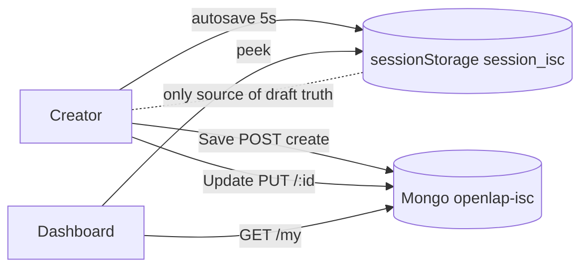
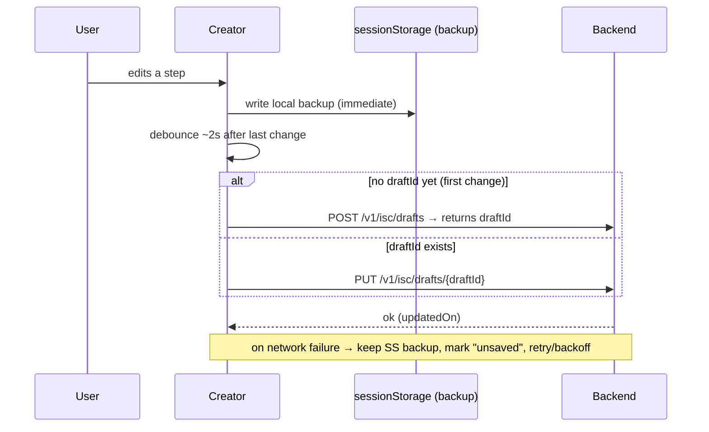
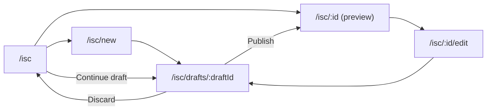
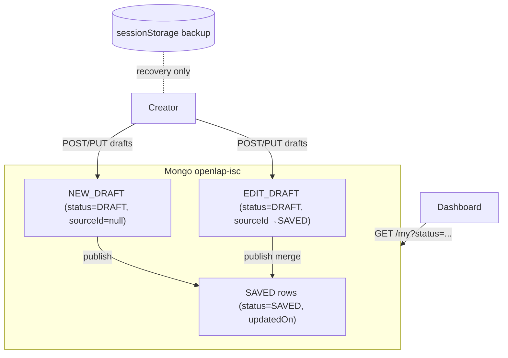

# ISC Draft / Saved Lifecycle — Backend + Frontend Audit & Target Design

> **Status:** audit + feasibility + target design. **No implementation.** Planning only.
> **Goal:** make **Draft** and **Saved** first‑class, **database‑backed** ISC states so
> drafts appear in My ISCs alongside saved ISCs, and `sessionStorage` is demoted to a local
> recovery cache (not the source of truth).
> **Companion docs:** [`ISC_LIFECYCLE_DASHBOARD_AUDIT.md`](./ISC_LIFECYCLE_DASHBOARD_AUDIT.md),
> [`ISC_CREATOR_ARCHITECTURE.md`](./ISC_CREATOR_ARCHITECTURE.md),
> [`ISC_STEP5_FINALIZE_ARCHITECTURE.md`](./ISC_STEP5_FINALIZE_ARCHITECTURE.md).
>
> Backend lives in `openlap-analyticsframework` (Spring Boot + MongoDB). Frontend in
> `openlap-indicatoreditor`. Every claim below cites the actual code.

---

## 1. Current architecture (audit)

### 1.1 Backend persistence model
- **Entity** `IndicatorSpecificationCard` (`@Document("openlap-isc")`,
  `entities/IndicatorSpecificationCard.java`):
  `{ id, requirements, dataset, visRef, lockedStep, @DBRef createdBy:User, createdOn }`.
  **No `status`, no `updatedOn`, no `sourceId`.** The four slices are **stringified JSON**.
- **Request DTO** `IscRequest`: four fields, **all `@NotBlank`** (`requirements`, `dataset`,
  `visRef`, `lockedStep`). A truly empty draft would fail validation.
- **Response DTOs:** `ISCResponse` (full, all slices — `getISCById`) and
  `IndicatorSpecificationCardResponse` (list summary: `id`, `indicatorName` parsed from the
  `requirements` JSON, `createdBy` name, `createdOn`).
- **Endpoints** (`controller/IscController.java`):
  - `POST /v1/isc/create` → `createIsc`; saves a new doc (`id=null` → Mongo generates,
    `createdOn=now`). **Returns only a success message — NOT the new id.**
  - `PUT /v1/isc/{iscId}` → `updateIsc`; overwrites all four slices and **resets
    `createdOn=now`** (loses original creation time; there is no `updatedOn`). **No owner
    check.**
  - `GET /v1/isc/my?page&size&sortBy&sortDirection` → paginated summaries. `sortBy` is a
    Spring `Sort.by(sortBy)` on the **entity**, so only `createdOn` is real (`indicatorName`
    is inside the JSON, not a field). **No search param, no status filter.**
  - `GET /v1/isc/{iscId}` → full `ISCResponse`. **No owner check.**
  - `DELETE /v1/isc/{iscId}` → owner‑checked delete.
- **Migrations:** none (schema‑flexible Mongo; new fields are simply absent on old docs).

### 1.2 Frontend persistence model (from the lifecycle audit)
- One `sessionStorage` key `session_isc` is the **de‑facto source of truth** for drafts and
  edit hand‑off. Creator autosaves the whole `{id, requirements, dataset, visRef,
  lockedStep}` every 5 s.
- Because **create returns no id**, after a first save the client cannot address the new
  row; it just `navigate("/isc")`. Create‑vs‑update is decided by `Boolean(SESSION_ISC.id)`.
- Drafts are **invisible** server‑side: they live only in the current browser session.



**Core problem:** drafts are browser‑local and ephemeral; the create/update decision and
"in‑progress" detection all hinge on one `sessionStorage` key.

---

## 2. Status field feasibility

**Yes — add a `status` enum `{ DRAFT, SAVED }`** to the entity. Mongo makes this additive
(absent on old docs → treat missing as `SAVED`, see §8).

**Edit‑draft modelling — options evaluated:**
| Option | How | Pros | Cons |
|---|---|---|---|
| **A. Same row + dirty flag** | edit autosaves mutate the existing SAVED row, marked dirty | one row; simple | 🔴 autosave **corrupts the published ISC** before the user commits; Discard can't cleanly restore; Preview‑saved‑version impossible |
| **B. Separate draft row + `sourceId`** ✅ | EDIT_DRAFT is a new row (`status=DRAFT`, `sourceId=savedId`); publish merges into the SAVED row and deletes the draft | published ISC untouched until commit; Discard = delete draft; preview‑saved trivial; mirrors NEW_DRAFT | one extra row; need uniqueness (one edit‑draft per source per user) |
| **C. Revision/history table** | every autosave appends a revision | full history/undo | over‑engineered for now; storage growth; more endpoints |

**Recommendation: Option B.** A NEW_DRAFT is a row with `status=DRAFT, sourceId=null`; an
EDIT_DRAFT is a row with `status=DRAFT, sourceId=<savedId>`. `draftKind` is **derivable**
from `sourceId` (null → NEW_DRAFT, set → EDIT_DRAFT) — no separate stored field needed,
though it can be returned in the DTO for convenience. Option B keeps the published ISC safe,
makes Discard a pure delete, and is the smallest safe step (C can come later if undo/history
is wanted).

---

## 3. Target draft persistence flows

```mermaid
stateDiagram-v2
  [*] --> NewDraft: Create new ISC (lazy: created on first change)
  NewDraft --> NewDraft: autosave (PUT draft)
  NewDraft --> Saved: Finalize & Save (publish: status DRAFT→SAVED)
  NewDraft --> Discarded: Discard (DELETE draft)

  Saved --> EditDraft: Edit (create/find EDIT_DRAFT, sourceId=Saved.id)
  EditDraft --> EditDraft: autosave (PUT draft)
  EditDraft --> Saved: Save changes (publish: merge draft → source SAVED, delete draft)
  EditDraft --> Saved: Discard changes (DELETE draft; source untouched)

  Saved --> Deleted: Delete (owner-checked)
  Discarded --> [*]
  Deleted --> [*]
```



- **Create new:** lazily create a `DRAFT` row on the **first meaningful change** (avoid
  empty drafts); autosave updates it; Finalize publishes `DRAFT → SAVED`.
- **Edit saved:** create (or reuse) an `EDIT_DRAFT` (`sourceId=savedId`); autosave updates
  the draft; **Save changes** copies the draft's slices into the source SAVED row and deletes
  the draft; **Discard** deletes the draft, leaving the SAVED row intact.

**Hard backend prerequisite:** **create/draft‑create must return the new id** (today
`createIsc` returns void). Without it the client cannot address the draft for subsequent
autosaves.

---

## 4. `/v1/isc/my` — returning Saved + Draft

Return both statuses; enrich the summary so the dashboard can render badges it currently
can't derive (visualization type, dataset size — both are computable server‑side by parsing
the `visRef`/`dataset` JSON, exactly as `indicatorName` is already parsed from `requirements`
in `getISCResponses`).

**Proposed list item:**
```jsonc
{
  "id": "…",
  "indicatorName": "…",
  "status": "DRAFT | SAVED",
  "draftKind": "NEW_DRAFT | EDIT_DRAFT | null",   // derived from sourceId
  "sourceId": "…|null",                            // set for EDIT_DRAFT
  "createdOn": "…",
  "updatedOn": "…",                                // NEW: real last-modified
  "visualizationType": "Bar chart|null",           // parsed from visRef.chart.type
  "datasetSize": { "rows": 6, "columns": 3 }       // parsed from dataset
}
```
**New query params:** `status` (filter DRAFT/SAVED/all), `search` (regex/text on a stored
title), and a name‑sortable field. To make **server‑side name sort + search** work, either
(a) **denormalize** `indicatorName` (and optionally `visualizationType`) onto the entity at
save time, or (b) add a Mongo `@Query` with a case‑insensitive regex on a stored title.
Option (a) is recommended (one extra stored field, enables sort+search cleanly) — it removes
the page‑scoped search/name‑sort limitation documented in the dashboard audit.

---

## 5. Frontend lifecycle (target)

- **Dashboard** lists **SAVED and DRAFT together** (one `/my` call), each with a **status
  badge** (Saved / Draft) and `updatedOn`. Filter by status; server‑side search/sort.
- **Row actions by status:**
  - **Saved:** Preview · Edit · Delete.
  - **New draft:** Continue · Discard.
  - **Edit draft:** Continue editing · Discard changes · Preview saved version (via
    `sourceId`).
- **`sessionStorage` is demoted** to a local‑recovery cache: the authoritative draft is the
  DB row addressed by `draftId`. The "you have an unfinished ISC" banner becomes redundant
  for discovery (drafts are visible in the list) — it can remain only as an optional
  "resume last edited locally" affordance, or be removed.

---

## 6. Autosave (target)



- **Debounced**, not a fixed interval — save ~2 s after the last change (and on
  step transitions / before unload). Avoids the current 5 s "Draft saved" spam.
- **Endpoint:** `PUT /v1/isc/drafts/{draftId}` (create lazily via `POST /v1/isc/drafts`).
- **Lazy creation:** create the draft on the **first meaningful change**, not on entering
  the creator, so abandoned empty sessions don't litter My ISCs.
- **Network failure:** keep the `sessionStorage` backup, show an "unsaved changes" state,
  retry with backoff; never lose the user's edits.
- **`sessionStorage` = backup only**, reconciled against the server draft on load.

---

## 7. Leave‑page behavior

- **Editing a saved ISC** with an unsaved edit‑draft → on leave, prompt **three** choices:
  - **Save changes** (publish draft → source SAVED),
  - **Keep draft** (leave the EDIT_DRAFT; resumable from My ISCs),
  - **Discard changes** (delete the EDIT_DRAFT).
- **New draft** → **no warning needed** once an autosave has succeeded: the draft is already
  a row in My ISCs and resumable. (Warn only if the first autosave hasn't landed yet.)

---

## 8. Migration strategy

- **Existing SAVED rows:** treat **missing `status` as `SAVED`** at read time (zero‑downtime),
  plus a one‑time backfill setting `status=SAVED` and `updatedOn=createdOn`. **Stop resetting
  `createdOn` on update** (current bug) and start maintaining `updatedOn`.
- **Existing `sessionStorage` drafts:** cannot be migrated server‑side (browser‑local).
  Optional one‑time **client** migration: on dashboard load, if `session_isc` exists, offer
  "Save your in‑progress ISC as a draft" (calls the new draft endpoint). **Do not rely on
  it** — it's a courtesy, not a guarantee.
- **Backwards compatibility:** keep `POST /create` and `PUT /:id` working (old clients);
  new draft endpoints are additive.

---

## 9. Route model (recommendation)

Make the **route authoritative for intent** (the prior audit's core fix), with the draft
addressed by `draftId` (not `sessionStorage`):

| Route | Purpose |
|---|---|
| `/isc` | Dashboard (Saved + Draft) |
| `/isc/new` | Start a new ISC → lazily creates a NEW_DRAFT, then redirects to `/isc/drafts/:draftId` |
| `/isc/drafts/:draftId` | Creator bound to a draft (new or edit; kind derived from `sourceId`) |
| `/isc/:id` | Preview a SAVED ISC (read‑only) |
| `/isc/:id/edit` | Entry: create/find the EDIT_DRAFT for `:id`, then redirect to `/isc/drafts/:draftId` |



Publish decision is **`draft.sourceId`**: null → create a new SAVED row; set → update the
source SAVED row. No more route/label/`SESSION_ISC.id` mismatch.

(The prompt's `/isc/:id/edit-draft/:draftId` is equivalent; collapsing edit‑drafts into the
single `/isc/drafts/:draftId` keeps one creator route and avoids duplicating the editor.)

---

## 10. Risks

- **Data loss:** today create returns no id and autosave is local‑only — any
  session clear loses a draft. Target fixes this, but the **autosave failure path must be
  explicit** (backup + retry) or it reintroduces loss.
- **Duplicate drafts:** multiple EDIT_DRAFTs for the same source (multiple tabs / repeated
  Edit clicks). Enforce **uniqueness on `(sourceId, createdBy)`**; "Edit" should find‑or‑create.
- **Edit conflicts:** two sessions editing the same source, or a draft based on a stale
  source. Needs **optimistic concurrency** (compare `updatedOn`/a version on publish) and a
  conflict resolution UX.
- **Autosave races:** overlapping debounced PUTs → last‑write‑wins can drop edits. Serialize
  per draft (cancel in‑flight) and/or version‑check.
- **Migration risk:** backfilling `status` and changing `createdOn` semantics. Mitigate with
  treat‑missing‑as‑SAVED + additive backfill; **fix the `createdOn` reset** carefully (it
  changes observable ordering).
- **Backwards compatibility:** `IscRequest`'s `@NotBlank` on all four slices means a **draft
  with incomplete data will fail validation** — drafts need a **relaxed draft DTO/endpoint**
  (allow partial/empty slices) separate from the strict publish validation.
- **Backend validation / security:** `updateIsc` and `getISCById` currently have **no owner
  check** — adding drafts (more rows, more endpoints) makes this more important; add owner
  checks on all mutating draft/publish endpoints.
- **Old `sessionStorage` behavior:** must be demoted to a backup and reconciled; a stale
  `session_isc` from the current scheme could otherwise resurrect the old ambiguous draft on
  first load after deploy (clear/ignore legacy key).

---

## Target architecture (summary diagram)



---

## 11. Phased roadmap (with dependencies)

| Phase | Scope | Depends on | Notes |
|---|---|---|---|
| **0 — Backend foundations** | Add `status`, `sourceId`, `updatedOn`; stop resetting `createdOn`; **create returns id**; treat missing status as SAVED; owner checks on mutations. | — | Pure additive + bugfix; unblocks everything. |
| **1 — Draft endpoints** | `POST /v1/isc/drafts` (lazy create, relaxed validation), `PUT /v1/isc/drafts/{id}`, `POST .../publish` (DRAFT→SAVED / merge to source), keep legacy create/update. | 0 | Relaxed draft DTO (no `@NotBlank`). |
| **2 — List enrichment** | `/my` returns `status/sourceId/draftKind/updatedOn` + enriched `visualizationType`/`datasetSize`; add `status` filter + server `search`/name‑sort (denormalize title). | 0,1 | Removes dashboard search/sort/badge limitations. |
| **3 — Frontend draft client** | Debounced autosave to draft endpoints; `draftId` as authoritative key; `sessionStorage` demoted to backup + reconcile; create returns id wired. | 1 | Replaces the `SESSION_ISC`‑as‑truth model. |
| **4 — Routes & dashboard** | New routes (`/isc/new`, `/isc/drafts/:draftId`, `/isc/:id/edit`); dashboard shows Draft+Saved with status badges + per‑status actions; banner demoted. | 2,3 | Builds on enriched list + draft client. |
| **5 — Leave‑page & conflicts** | Save/Keep/Discard prompt for edit drafts; optimistic concurrency on publish; duplicate‑draft find‑or‑create. | 3,4 | Hardening. |
| **6 — Migration & cleanup** | Backfill status/updatedOn; one‑time client `sessionStorage`→draft offer; clear legacy key. | 0–5 | Last; safe and optional. |

**Dependency rationale:** backend foundations (0) and draft endpoints (1) must exist before
the frontend can treat drafts as DB‑backed (3); list enrichment (2) is needed before the
dashboard redesign (4) can show statuses/badges; conflict/leave hardening (5) and migration
(6) come last.

---

*Audit + design only. No code changes. Use as the brief for Phase 0 onward; keep consistent
with `ISC_LIFECYCLE_DASHBOARD_AUDIT.md`.*
