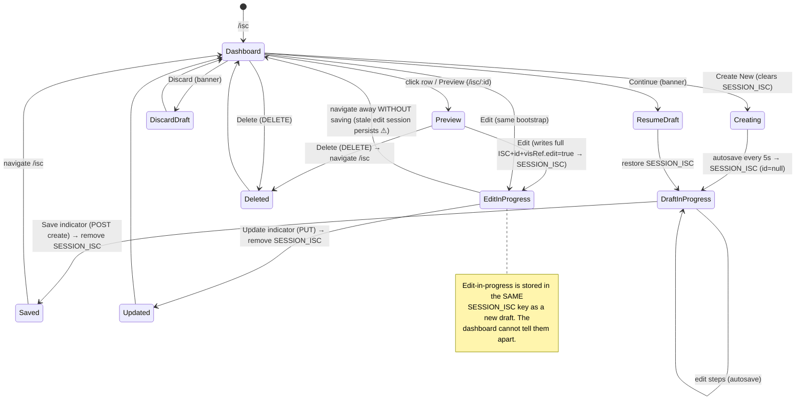
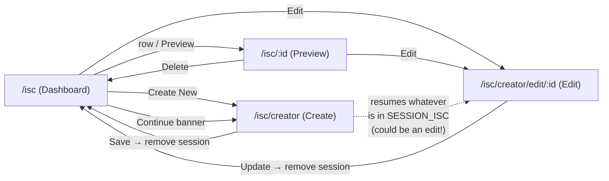
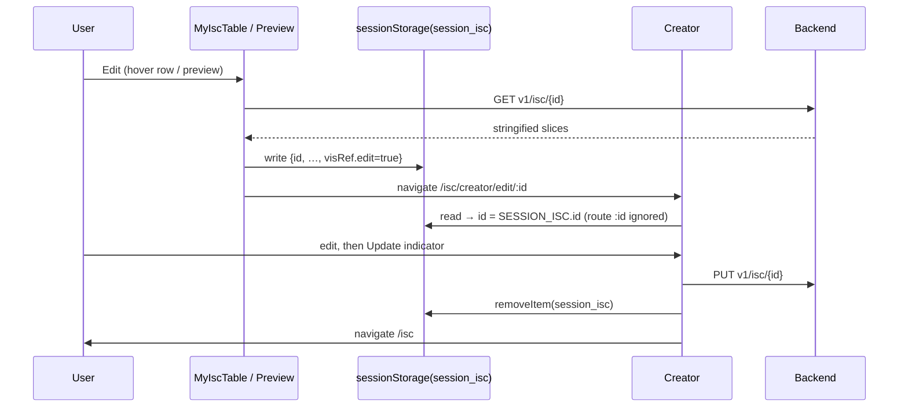
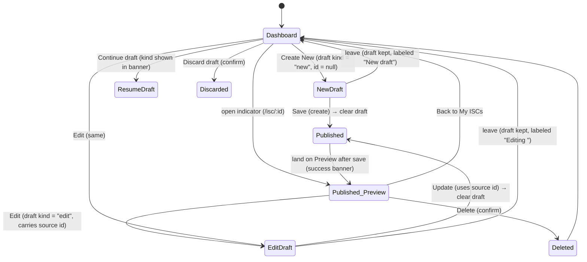

# ISC Lifecycle & Dashboard — Audit & Target Design

> **Status:** product / UX / architecture audit. **No code changes.** Planning only.
> **Scope:** Dashboard (My ISCs), Preview ISC, Edit workflow, draft management, and the
> routing/navigation that ties them together.
> **Companion docs:** [`ISC_CREATOR_ARCHITECTURE.md`](./ISC_CREATOR_ARCHITECTURE.md),
> [`ISC_STEP5_FINALIZE_ARCHITECTURE.md`](./ISC_STEP5_FINALIZE_ARCHITECTURE.md).
> Benchmark referenced throughout: **LearnDeck** (modern list/card productivity UI).
>
> Every observation below is grounded in the current code (file:line cited). The ISC
> Creator itself was redesigned (Steps 1–5); the lifecycle *around* it is now the weak link.

---

## 1. Current lifecycle audit

The lifecycle is mediated almost entirely by **one sessionStorage key** (`session_isc`,
`SESSION_ISC` in `auth-context-manager.jsx:11`) plus four routes. There is **no explicit
"draft" entity** — a draft is simply "whatever is currently in `SESSION_ISC`".



**States that exist:** Dashboard, Creating, DraftInProgress, ResumeDraft, DiscardDraft,
Preview, EditInProgress, Saved, Updated, Deleted. **The critical gap:** *DraftInProgress*
and *EditInProgress* are the same storage state with no marker distinguishing them.

---

## 2. Route audit

| Route | Component | Concept | Source |
|---|---|---|---|
| `/isc` (index) | `IscDashboard` | My ISCs list + draft banner | `app-routes.jsx:312` |
| `/isc/:id` | `IscPreview` | Read-only preview | `app-routes.jsx:324` |
| `/isc/creator` (index) | `IndicatorSpecificationCard` | "Create" — but really "resume SESSION_ISC" | `app-routes.jsx:338` |
| `/isc/creator/edit/:id` | `IndicatorSpecificationCard` | "Edit" | `app-routes.jsx:350` |
| `/isc/pool` | `ISCPool` | Shared pool (out of scope) | `app-routes.jsx:363` |

`/isc/creator*` is rendered **full‑bleed** (`FULL_BLEED_PATH_PREFIXES = ["/isc/creator"]`,
`app-routes.jsx:94`).



**Findings:**
- **Reused component, two routes:** `IndicatorSpecificationCard` serves both `/isc/creator`
  and `/isc/creator/edit/:id`. Behavior differs **not by route** but by `SESSION_ISC`
  contents.
- **A route that represents multiple concepts:** `/isc/creator` (index) nominally means
  "new", but the creator restores `SESSION_ISC` regardless — so it can silently be an
  *edit* session.
- **The `:id` route param is decorative.** The creator derives `id` from
  `SESSION_ISC.id`, **not** `useParams().id` (`indicator-specification-card.jsx:26–33`).
  The route param is used only for button labels (`finalize.jsx` `params.id`,
  `name-dialog.jsx` `params.id`) while the actual create‑vs‑update API decision is
  `Boolean(id)` from context (`name-dialog.jsx`). → **state leaks between routes**: at
  `/isc/creator` (no param) a Save can perform an **UPDATE** if `SESSION_ISC.id` is set.
- **Confusing routing:** "Preview" lives at `/isc/:id` while "Edit" lives at
  `/isc/creator/edit/:id` — the same indicator has two unrelated URL shapes.

---

## 3. Draft architecture audit

**Single source:** `sessionStorage["session_isc"]`. There is no separate "drafts" store and
no draft id.

- **How a draft is created:** the creator's autosave effect writes
  `{ id, requirements, dataset, visRef, lockedStep }` to `SESSION_ISC` **every 5 s**
  (`indicator-specification-card.jsx:192–227`). For a brand‑new ISC, `id` is `null`.
- **Where stored:** session storage only — never persisted server‑side until Save/Update.
- **After Save (create):** `name-dialog.jsx` calls `requestCreateISC` (POST
  `v1/isc/create`), then `sessionStorage.removeItem(SESSION_ISC)` and `navigate("/isc")`.
- **After Update:** `requestUpdateISC` (PUT `v1/isc/{id}`), then same remove + navigate.
- **Editing an existing ISC:** `my-isc-table.handleEditIndicator` (`:107`) and
  `isc-preview.handleEditIndicator` (`:86`) both: fetch details, `JSON.parse` each slice,
  set **`parsedData.visRef.edit = true`**, write the **whole ISC incl. real `id`** to
  `SESSION_ISC`, then `navigate("/isc/creator/edit/:id")`. The creator restores it; `id`
  comes from `SESSION_ISC.id`.
- **Why "Create" can reopen an edited indicator:** see §7. Root cause: edit‑in‑progress and
  new‑draft share the same `SESSION_ISC` key, and the dashboard's banner only checks
  `Boolean(sessionStorage.getItem(SESSION_ISC))` (`isc-dashboard.jsx:24–27`).
- **How sessionStorage participates:** it is the *de facto* application state for the whole
  lifecycle — draft persistence, edit hand‑off, create‑vs‑update decision, and the
  dashboard's "in progress" detection all read/write this one key.

**Ambiguities identified:**
1. No flag distinguishes **new draft** vs **edit‑in‑progress** (both just have a body; one
   has `id`, but the banner doesn't inspect it).
2. "Create New" clears the session **without confirmation** — `handleCreateNew` →
   `handleClearSession()` → `removeItem` (`my-isc-table.jsx:188–192`, with a literal
   `// TODO: Another check need if there is exist a draft`). Silent draft loss.
3. The dashboard/preview **hand‑parse** the persisted JSON (`JSON.parse(parsedData.*)`)
   instead of going through the serialization adapter (`isc-serialization.js`), so any
   schema migration is bypassed on the edit path.
4. Leaving an edit screen without saving leaves a **stale edit session** that later masquerades as a draft.

---

## 4. Dashboard audit (My ISCs)

`MyIscTable` (`my-isc-table.jsx`) renders a single‑column MUI `Table` of indicator names +
"Created on", with hover‑revealed Preview/Edit/Delete icons, a Create New button, and a
toggle search.

**Strengths:** clean, uncluttered; server‑paginated list endpoint (`v1/isc/my`); decent
empty state with a CTA (`:411`); delete confirmation dialog.

**Weaknesses (grounded):**
- 🔴 **Pagination is effectively broken.** `loadMyISCList` runs only on mount
  (`useEffect(..., [])`, `:86–88`). `handlePageChange`/`handleRowsPerPageChange` update
  `state.params` but **nothing refetches** — changing page/size does not load new data.
- 🔴 **Search is client‑side over one page only.** It filters `state.indicatorList`
  (the current server page of ≤10) by name (`:90–97`), so it misses indicators on other
  pages; it is name‑only.
- 🔴 **Hover‑only actions + `onHoverIndicatorId`.** Edit/Delete target the **last‑hovered**
  row (`handleOnHoverIndicator`, `:99`; `handleEditIndicator` uses
  `state.onHoverIndicatorId`). Keyboard and touch users can't reliably set the target, and
  the `.hover-actions` opacity trick (`:286`) hides actions until hover — poor
  discoverability and a real accessibility gap.
- 🟠 **No sort UI.** `params.sortBy/sortDirection` are fixed to `createdOn`/`dsc`.
- 🟠 **Thin information.** Only name + createdOn. No **status** (draft vs published), no
  **last updated**, no **visualization** or **dataset** badge, no goal/question context.
- 🟠 **No header / stats / quick actions.** The page is a breadcrumb, an optional draft
  banner, and the table.
- 🟢 The draft banner exists but is binary and can't describe *what* the draft is.

**Vs. LearnDeck:** LearnDeck‑style productivity lists provide a welcome/header zone,
counts/stats, real server search + filters + sort, status badges, last‑updated, and a
list/card toggle. My ISCs currently has **none** of these and has broken pagination/search.

---

## 5. List vs Card view

| | List view | Card view |
|---|---|---|
| **Best for** | scanning many items, dense metadata, sorting/comparison | visual recognition (chart thumbnail), fewer items, "gallery" feel |
| **Benefits** | high information density; easy bulk selection; compact | shows the *visualization* (the most recognizable attribute of an ISC) |
| **Trade‑offs** | less visual; chart not shown | lower density; more scrolling; heavier to render thumbnails |

**Recommendation:** support **both**, toggled (LearnDeck pattern). An ISC's defining trait
is its **chart + question**, which a card thumbnail conveys instantly — but power users
managing many ISCs need the dense list. **Search/filter/sort/pagination state must be
shared** across both views (single query state; only the renderer differs), otherwise
toggling would reset results. Responsive: cards in a responsive grid (1/2/3 columns), list
collapses secondary columns on small screens; default to list on narrow viewports.

---

## 6. Preview audit (`IscPreview`)

Shows: title + createdOn, Edit/Delete, goal/question/indicator‑name chips, "data required"
chips (derived from `visRef.data.axisOptions.selected*` via `handleDataRequiredByUser`,
`:138`), chart idiom chip, and a Vis/Dataset toggle rendering `PreviewChart` / `DataTable`.

**Findings:**
- **Information hierarchy:** reasonable top‑down (identity → requirements → data → chart),
  but everything is equal‑weight chips; no emphasis on the actual result (the chart).
- 🔴 **Delete tooltip mislabeled "Edit indicator"** (`:211`) — copy bug on the delete button.
- 🟠 **Edit bootstrap duplicated** with `my-isc-table` (both parse + set `visRef.edit=true`
  + write `SESSION_ISC`) — two copies of the fragile edit hand‑off.
- 🟠 **Metadata thin:** `createdBy`, `createdOn` (string‑split on `"T"`, `:183`); no updated‑at, no status.
- 🟢 Readable; the Vis/Dataset toggle is a nice touch.

**Should Preview stay read‑only?** Yes — a stable, shareable, read‑only view of a published
indicator is valuable. **Should editing always start from Preview?** Routing edit *through*
Preview would centralize the (currently duplicated) edit bootstrap and give users a
"review → edit" mental model — but a direct Edit from the list is faster for power users;
keep both entry points but **share one bootstrap**. **Should Preview be the landing page
after saving?** Pros: confirms "here is my saved indicator", natural close to the Step 5
"finalize" story, encourages review. Cons: extra hop vs. returning to the list; today Save
navigates to `/isc`. A reasonable target: after save, land on **Preview** (`/isc/:id`) with
a success banner, with a clear "Back to My ISCs".

---

## 7. Editing workflow audit (highest priority)

**Happy path — Dashboard → Preview → Edit → Creator → Update → Dashboard:**

This path works. The fragility is what happens when the user **does not** complete it.

**The bug — Draft exists / edit abandoned → Create or Continue → unexpected edit state:**
```mermaid
sequenceDiagram
  participant U as User
  participant SS as sessionStorage(session_isc)
  participant D as Dashboard
  participant C as Creator
  participant API as Backend
  U->>C: (was editing /isc/creator/edit/:id) navigate away w/o saving
  Note over SS: SESSION_ISC still holds the edited ISC (id + visRef.edit)
  U->>D: open /isc
  D->>SS: Boolean(getItem) → true → show "indicator in progress" banner
  U->>D: click Continue
  D->>C: navigate /isc/creator  (index, NO route id)
  C->>SS: read → id = SESSION_ISC.id (the EXISTING indicator's id!)
  U->>C: Save (button labeled "Save indicator", params.id undefined)
  C->>API: PUT v1/isc/{id}  ← UPDATES the existing indicator
  Note over U,API: User thought they were creating new; they overwrote an existing ISC
```

**Precise cause:** edit‑in‑progress and new‑draft are stored under the **same key** with
**no discriminator**; the dashboard banner inspects only presence, not identity; the
creator's create‑vs‑update decision is `Boolean(SESSION_ISC.id)` and is **decoupled from
the route** and from the button label. "Create New" *happens* to clear the session
(`handleClearSession`), so it's safe — but **"Continue"** on an abandoned edit silently
resumes an update, and the "create" route + "Save" label misrepresent it.

---

## 8. Target product workflow

Make **Draft**, **Published Indicator**, **Preview**, **Edit**, **Update**, **Delete**, and
**Create New** first‑class and unambiguous.



**Key principles:**
- A draft carries an explicit **kind** (`new` vs `edit`) and, for edits, the **source id** —
  so the dashboard banner can say *"Resume new indicator"* vs *"Continue editing
  ‹name›"*, and Create New can warn before discarding.
- **Create‑vs‑update is decided by the draft kind, not by route presence or `SESSION_ISC.id`
  alone**, and the Save button label must match the action.
- **Route is authoritative for intent:** `/isc/creator` only ever means *new*;
  `/isc/creator/edit/:id` only ever means *edit ‹id›*. Resuming a draft routes to the
  matching shape.
- After save → land on **Preview** of the saved indicator with a success state.

---

## 9. Dashboard redesign proposal (no implementation)

A LearnDeck‑adapted "indicator management" surface:
```
┌────────────────────────────────────────────────────────────────────┐
│ Welcome / My ISCs            [stats: N indicators · M drafts]        │
│ [⚠ Draft: "Editing ‹Course completion›" — Resume · Discard]          │
│ [+ Create new]   [search…]  [filter ▾]  [sort ▾]      [≣ list│▦ card]│
├────────────────────────────────────────────────────────────────────┤
│  ▦ card: chart thumbnail · name · question · [Bar] [3×4] · updated   │
│  ▦ card …                                                            │
│   — or —                                                             │
│  ≣ row: name · status · viz badge · dataset badge · updated · ⋯      │
└────────────────────────────────────────────────────────────────────┘
```
- **Welcome header + stats:** total indicators, drafts in progress.
- **Draft banner:** kind‑aware ("New draft" vs "Editing ‹name›"), Resume + Discard.
- **Quick actions:** Create new (warns if a draft exists).
- **Server‑side search + filters + sort** (fix the current client‑only/￯broken behavior):
  filter by status / visualization type; sort by updated/created/name.
- **List/Card toggle** sharing one query state (§5).
- **Cards:** chart thumbnail (reuse `PreviewChart`), name, question, **visualization badge**,
  **dataset badge** (rows×cols), **status badge**, **last updated**.
- **Row actions** always visible + keyboard‑reachable (replace hover‑only + `onHoverIndicatorId`).
- **Bulk actions** (optional): multi‑select delete.

---

## 10. Roadmap (phased, with dependencies)

| Phase | Scope | Depends on | Why here |
|---|---|---|---|
| **A — Workflow & draft architecture** | Make drafts explicit (kind + source id); route is authoritative for create vs edit; align Save label/action; kind‑aware banner; confirm before discard. | — | Foundation; fixes the §7 data‑loss/overwrite bug. Everything else assumes a clean lifecycle. |
| **B — Dashboard data correctness** | Fix server‑side pagination/search/sort (refetch on param change; search the server, not one page). | A (shared query state) | Current list is functionally broken; must be right before reskinning. |
| **C — Dashboard redesign** | Header/stats, badges, last‑updated, always‑visible + keyboard actions, list/card toggle. | B | Visual/UX layer on a correct data layer. |
| **D — Preview redesign** | Hierarchy, fix delete tooltip, single shared edit bootstrap, richer metadata; optional "land on Preview after save". | A, C | Edit bootstrap unification depends on A's draft model. |
| **E — Edit workflow polish** | Centralize the edit hand‑off (one helper), route through the authoritative model, stale‑session cleanup on exit. | A, D | Builds on the unified bootstrap + draft kinds. |

Ordering rationale: **A before everything** (it removes the ambiguity that makes the rest
risky); **B before C** (don't paint a broken table); **D/E** consume A's draft model and the
unified edit bootstrap.

---

## 11. Architectural risks (no fixes proposed)

- **sessionStorage as de‑facto app state.** One key (`session_isc`) holds draft, edit
  hand‑off, create‑vs‑update signal, and "in progress" detection. Single point of ambiguity
  and the source of the §7 overwrite bug.
- **Routing not authoritative.** `/isc/creator` (index) can be an edit; `:id` in
  `edit/:id` is ignored in favor of `SESSION_ISC.id`. Route ≠ behavior.
- **Shared creator state across two routes.** The same component is "create" and "edit";
  distinguishing them relies on storage contents, not props/route.
- **Edit vs draft indistinguishable.** No kind/marker; the banner can't describe or guard.
- **Serialization bypass on edit/preview.** `my-isc-table`/`isc-preview` hand‑parse the
  stored JSON instead of using `isc-serialization.js`, so schema migrations don't run on
  those paths; `visRef` carries the full ApexCharts options (see Step 5 doc) — any future
  `visRef` change must stay compatible here too.
- **Preview consistency.** Preview derives "data required" from `visRef.data.axisOptions`;
  if that shape changes (Step 5H cleanup), Preview breaks silently.
- **Dashboard correctness debt.** Broken pagination + page‑local search will mislead users
  with >10 indicators (they'll appear to "lose" ISCs).

---

*Audit only. Use as the brief for Phase A onward. Keep consistent with
`ISC_CREATOR_ARCHITECTURE.md` and the Step 5 architecture doc.*
