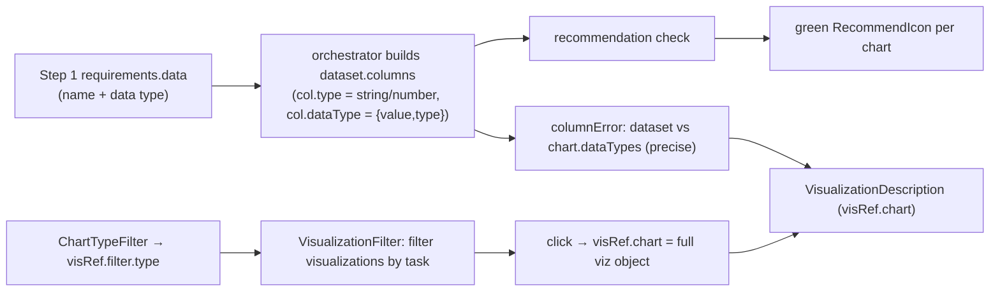
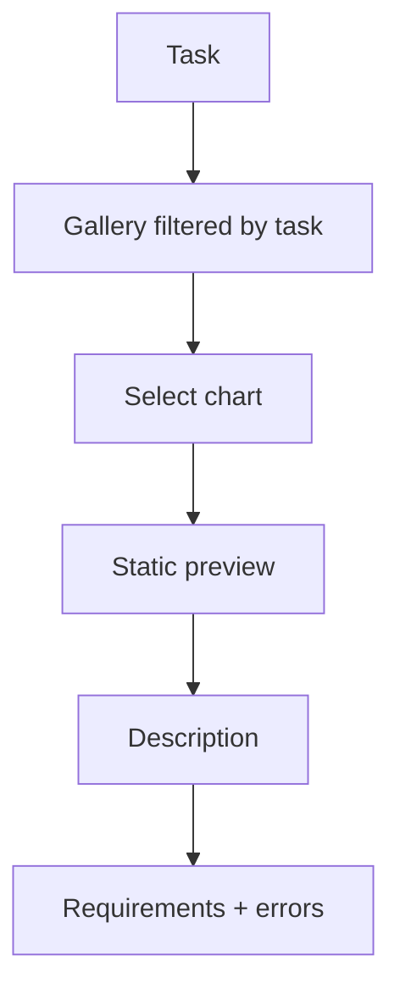
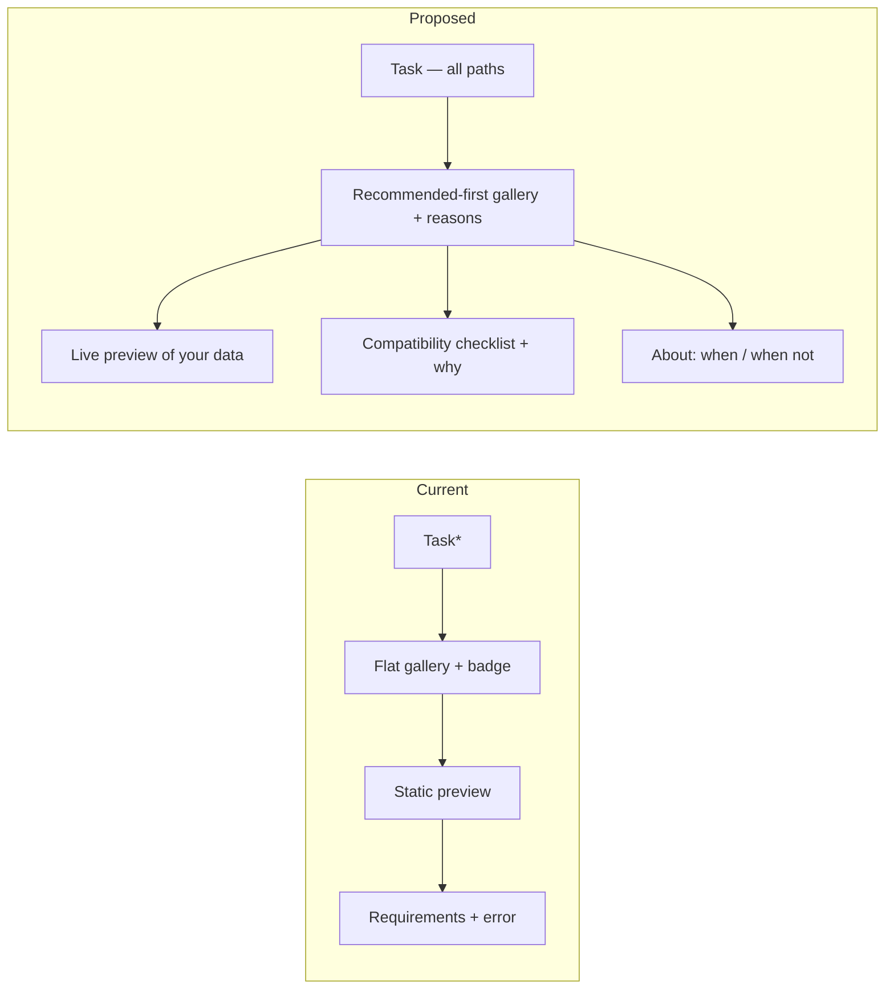

# ISC Creator — Step 3 (Choose Visualization) Audit & Design

> **Status:** audit + design proposal. **No code changes** accompany this document.
> **Audience:** designers + frontend architects implementing the Step 3 redesign in
> phased PRs.
> **Companion docs:** [`ISC_CREATOR_ARCHITECTURE.md`](./ISC_CREATOR_ARCHITECTURE.md)
> (overall blueprint), [`UI_ARCHITECTURE.md`](./UI_ARCHITECTURE.md) (shell/theme/primitives).
>
> Step 3 is where OpenLAP's core value — *teaching the link between an analytical
> task and the right visualization* — lives or dies. The five conceptual phases and
> the task→chart pedagogy must be preserved; this document is about presenting them
> far better.

---

## 1. Purpose & context

Step 3 currently bundles **six responsibilities** into one panel:
1. **Analytical task** selection (Trends, Outliers, Distribution, …)
2. **Visualization recommendation** (green badge on compatible charts)
3. **Visualization education** (descriptions, "learn more")
4. **Chart preview** (a static example image)
5. **Chart explanation** (short + full descriptions)
6. **Chart requirements** (required data-type counts + dataset validation)

This audit asks: are these presented in the best possible way, and what is the ideal
workflow?

---

## 2. Current implementation audit

### 2.1 Component hierarchy
```
visualization.jsx  (Step 3 — wrapped in WorkflowSection)
├─ VisualizationSummary            # collapsed summary (task + chart)
└─ Collapse (open when active)
   ├─ [path === Task]          ChartTypeFilter  →  VisualizationFilter (after a task is picked)
   ├─ [path === Visualization] VisualizationFilter
   ├─ [path === Dataset]       ChartTypeFilter  →  VisualizationFilter
   └─ Next button              # disabled until a chart is selected
        VisualizationFilter
        ├─ chart gallery (filtered by task) with green RecommendIcon badges
        └─ Grow → VisualizationDescription   # appears after a chart is selected
             ├─ left:  static example image (chart.imageDescription)
             └─ right: short description + "Learn more" + Requirements chips + column-error alerts
```
`VisSelection` (the **live** chart renderer) is **not** used here — it belongs to
**Finalize (Step 5)**. Step 3's "preview" is a generic PNG/SVG of the chart type.

### 2.2 State flow

- `visRef.filter` = chosen analytical task. `visRef.chart` = the **entire** chosen
  visualization config object (images, descriptions, dataTypes, link…). Both are
  persisted inside the serialized `visRef`.
- Selection is a **toggle** (re-click deselects). Choosing a chart clears two
  `localStorage` keys (`categories`, `series`) — a side effect flagged `// TODO`.

### 2.3 Recommendation logic (and a correctness gap)
- Per chart: `checkVisualizationRecommendation(viz, columnTypes)` sums required
  categorical/numerical/ordinal from `viz.dataTypes`, counts **`col.type`**
  (`"string"`/`"number"`) in the dataset, and recommends if
  `availableStrings ≥ requiredCategorical + requiredOrdinal` **and**
  `availableNumbers ≥ requiredNumerical`.
- 🔴 **Inconsistency:** the **badge** uses coarse `col.type` (string vs number, so it
  *cannot* distinguish Categorical from Categorical-ordinal), while the **requirements
  error panel** (`columnError`) uses the precise `col.dataType.value`
  (`"Categorical"` / `"Categorical (ordinal)"` / `"Numerical"`). A chart can therefore
  be **badged "recommended" yet show a requirements error**, or the reverse. Two
  different notions of "compatible" coexist.
- Recommendations are driven by `dataset.columns`, which the orchestrator seeds from
  **Step 1's declared data** — a real pedagogical thread that is never surfaced to the
  user (the only hint is the vague "Recommendations are based on your dataset").

### 2.4 Preview, description, requirements
- **Preview:** a **static** `imageDescription` image — *not* the user's data. The live,
  data-driven chart only appears in Finalize.
- **Description:** short text + a "Learn more" external link (Data Viz Catalogue); the
  same short text also lives in each card's **hover tooltip**.
- **Requirements:** chips like "#Categorical data columns: `1`". When the dataset can't
  satisfy them, an error Alert lists the gaps + a generic "possible fix" Alert.

### 2.5 Icons, badges, navigation, summary, validation, save
- **Icons:** SVG task images + SVG chart thumbnails; green `RecommendIcon`.
- **Navigation:** task → gallery → (select) → description reveals (`Grow`). A **Next**
  button unlocks the following step.
- **Summary (collapsed):** shows the chosen task + chart type.
- **Validation:** Next is disabled **only** when no chart is selected
  (`visRef.chart.type === ""`). **Column/requirement errors do *not* block Next** — a
  user can proceed with a chart their data can't satisfy.
- **Save:** the whole `visRef` (incl. the full chart object) is serialized into the ISC
  payload; editing rehydrates it.

---

## 3. Multi-perspective evaluation

### 3.1 Learning-Analytics perspective
- The **task → visualization** model is present and pedagogically sound, but the
  **relationship is implicit**: picking a task silently filters the gallery; nothing
  explains *why* a task maps to certain charts, or *why* a chart is recommended for
  *this* indicator's data. A beginner sees a green tick but not the reasoning
  ("recommended because you have 1 categorical + 1 numerical column").
- The **Visualization-first path** shows **no task selector at all**, so those users
  skip the analytical-task framing entirely — a pedagogical inconsistency across paths.

### 3.2 UX perspective
- **Cognitive load:** high — task grid + chart grid + reveal + requirements + errors,
  all stacked, with meaning hidden in tooltips.
- **Discoverability:** the badge's meaning, the task→gallery filtering, and "you can
  proceed even if requirements fail" are all under-communicated.
- **Visual hierarchy:** flat — tasks and charts are similar-weight boxes; the selected
  state is a thin orange border; the most important artifact (the chart itself) is a
  small static image revealed late.
- **Decision-making:** the user can't easily compare charts or understand trade-offs.
- **Feedback:** selection feedback is subtle; recommendation feedback is binary.
- **Empty/loading/error states:** no gallery empty state; no loading state (data is
  local); the requirements **error** state is good but disconnected from the badge and
  non-blocking; there is no "no charts match this task/data" state.
- **Accessibility:** task & chart cards are **clickable `Paper` divs** (not buttons),
  meaning lives in **hover tooltips** (poor for keyboard/touch), and there are no
  pressed/selected ARIA semantics.

### 3.3 Visualization perspective
- **Gallery:** a flat icon grid; charts that fit and charts that don't look nearly
  identical (one has a tick).
- **Badges:** "recommended" with **no reason**, and computed by a **coarser** rule than
  the requirements panel (see §2.3).
- **Preview:** a stock image, so users never see *their* data shaped by the chart before
  Finalize — the single biggest missed opportunity.
- **Descriptions/requirements:** present but generic; no "**when to use / when not to
  use / what question it answers**"; no chart-to-chart comparison.
- **Would a user know why one chart is better than another?** **No** — only that some
  have a green tick.

### 3.4 Enterprise-SaaS perspective
Today it reads as a **static icon gallery with a tooltip**, closer to a clip-art picker
than to **Power BI / Tableau / Looker** "recommended visualizations," or to
Copilot/Notion-AI guidance. Mature tools: rank suggestions, **explain the suggestion**,
show a **live thumbnail of your data**, and warn when a choice is poor. Step 3 has the
*data* to do this (Step-1 types + dataset) but doesn't present it that way.

---

## 4. Current interaction model — is the order optimal?

Current: **Task → Chart gallery → (select) → Preview → Description → Requirements**.



Assessment: the **sequence is reasonable** (narrow by intent → choose → learn), but:
- Preview/description/requirements are **downstream and static**, so the "learn" payload
  arrives late and isn't about the user's data.
- The **task step is skipped** on the Visualization path.
- **Requirements are decoupled from recommendation**, so "compatible" is ambiguous.

The order is *acceptable*; the **content and feedback at each stage** are the problem.

---

## 5. Recommendations — placement & treatment

Proposed:
- **Surface recommended charts first**, in their own clearly-labelled group ("Recommended
  for your data"), followed by "Other charts" — rather than mixing a subtle badge into a
  flat grid.
- **Do not hide** unsupported charts (hiding removes learning and feels broken). Instead
  **show them as available-but-explained**: de-emphasized, with a short "needs 2
  numerical columns — you have 1" note and a one-click path to fix it. Greying alone
  (today's locked-step mistake) is not enough — pair any de-emphasis with a reason.
- Make the badge **explain itself** ("Recommended: your data has 1 categorical + 1
  numerical column").
- **Unify the compatibility rule** so the badge and the requirements panel agree
  (resolve §2.3 — use the precise `dataType.value` in both).

---

## 6. Preview — evaluation

- **Today:** small, static, downstream, generic.
- **Proposed:** make the preview **first-class and live** — render the chart **with the
  user's (Step-1/dataset) data**, prominently (a dedicated preview pane), updating
  **instantly** as the task/chart/axes change. This is the same `LivePreview` concept
  from the overall blueprint (§7 of `ISC_CREATOR_ARCHITECTURE.md`) and the highest-impact
  change for researchers. Keep the static "example/ideal" image as a secondary
  "what this chart looks like in general" reference.
- Needs placeholder/loading/error states: "Pick a chart to preview", a skeleton while
  series compute, and a graceful "this chart needs … to render" message (distinct from a
  crash).

---

## 7. Requirements panel — evaluation

- **Today:** static count chips + a separate error alert; not obviously tied to the
  user's actual columns; non-blocking.
- **Proposed:** a **live compatibility checklist** per requirement, evaluated against the
  current indicator/dataset:
  - ✅ "1 categorical column — satisfied (you have *Material*)"
  - ⚠️ "2 numerical columns — you have 1 (add one in Step 1 or Dataset)"
- Users should **immediately see** whether their indicator satisfies the chart, with the
  same rule that drives the recommendation badge. Whether an unsatisfied chart should
  *block* Next is a product decision (today it doesn't); at minimum it should **warn
  clearly** before proceeding.

---

## 8. Educational guidance — where to teach

Step 3 should teach at three moments:
1. **At the task step:** one line per task — *what kind of question it answers* ("Trends:
   how something changes over time").
2. **On each chart (inline, not hover-only):** **"What question it answers"**, **"When to
   use"**, **"When *not* to use"** — short, scannable, always visible (e.g., an
   expandable "About this chart").
3. **At selection / preview:** **"Why this is recommended (or not) for *your* data"**,
   tied to the live compatibility checklist.

This converts the green tick from a verdict into a **teachable explanation**.

---

## 9. Future AI opportunities (no implementation)

The current rule-based recommender is the seam for later AI, behind a stable interface:
- **AI recommendations & ranking:** order charts by fit using data shape + the Step-1
  goal/question/task (not just column counts), returning a ranked list.
- **Automatic explanation:** generate per-chart "why / why not for your data" text.
- **Automatic axis suggestion:** propose X/Y/series mappings (feeds the axis step).
- **Automatic warnings:** "a pie chart with 12 categories is hard to read."
- **Confidence score:** show a 0–100 fit score / "best match" ribbon.
Keep the rule engine as the explainable fallback; AI augments, never silently overrides.

---

## 10. Design proposal

**Principle:** a **guided, explained, live** recommendation experience — task framing for
everyone, a recommended-first gallery with reasons, a prominent live preview, and a
compatibility checklist — preserving the task→chart pedagogy and all saved-ISC behavior.

### Proposed layout (two-pane within the Step 3 section)
```
┌───────────────────────────────────────────────────────────────────────┐
│ Choose visualization                                                    │
│ 1) What do you want to find out?  [Trends][Outliers][Distribution]…     │  ← task (all paths)
│    (each task: one-line "answers questions like …")                     │
├──────────────────────────────────────┬────────────────────────────────┤
│ 2) Recommended for your data          │  LIVE PREVIEW (your data)       │
│    [Bar ✓ why][Pie ✓ why] …           │  ┌──────────────────────────┐   │
│    Other charts                       │  │  chart renders instantly │   │
│    [Scatter — needs 2 numeric] …      │  └──────────────────────────┘   │
│                                       │  Compatibility checklist:       │
│ 3) About this chart (selected)        │   ✅ 1 categorical  ⚠️ 2 numeric │
│    What it answers · When to use ·    │  About: when to use / not use   │
│    When not to use · Learn more       │                                 │
└──────────────────────────────────────┴────────────────────────────────┘
```

### Current → Proposed
| Dimension | Current | Proposed |
|---|---|---|
| Task framing | Only Task/Dataset paths | **All paths** (consistent pedagogy) |
| Gallery | Flat grid + subtle badge | **Recommended-first groups**, reasoned badges |
| Unsupported charts | Look the same, no reason | **Shown + explained** (what's missing, how to fix) |
| Recommendation rule | Coarse `col.type`, ≠ requirements | **One precise rule** drives badge + checklist |
| Preview | Static example image, late | **Live, data-driven, prominent, instant** |
| Requirements | Count chips + separate error | **Live compatibility checklist** |
| Education | Hover tooltips | **Inline why/when/when-not** |
| Cards | Clickable `div`s, hover meaning | **Real buttons**, ARIA, visible meaning |



### Trade-offs
- **Live preview** adds render cost + partial-data handling → debounce, memoize series,
  keep the chart renderer pure (reuse Finalize's chart components carefully without
  changing them in this step).
- **Recommended-first grouping** risks hiding learning if "other charts" feel
  second-class → keep them fully usable + explained.
- **Unifying the compatibility rule** changes which charts show the badge in edge cases
  (Categorical vs ordinal) → verify against saved ISCs; it's a *correctness* fix but is a
  behavior change to flag.
- **Task on all paths** changes the Visualization-path flow → must preserve `visRef`
  shape and downstream ordering; introduce as additive framing, not a data change.

---

## 11. Implementation roadmap (safe phases)

| Phase | Scope | Why here |
|---|---|---|
| **3A — Interaction redesign (no behavior change)** | Restructure the Step 3 layout into the two-pane scaffold (task / gallery / preview / about) wrapping the **existing** components; convert clickable `Paper`s to real buttons + selected ARIA. No logic change. | Establish the frame + fix a11y first, lowest risk. |
| **3B — Task selector** | `TaskSelector` component with inline "answers questions like…"; consistent across paths (additive framing). | Sets the pedagogical context the gallery builds on. |
| **3C — Recommendation gallery** | Recommended-first grouping + **unified, precise** compatibility rule + self-explaining badges ("recommended because…"). | The core value; depends on the unified rule. |
| **3D — Chart preview** | Promote a **live** `LivePreview` of the user's data (reuse chart renderers), prominent + instant, with placeholder/loading/error. | Highest user value; needs the gallery selection from 3C. |
| **3E — Requirements panel** | Replace count chips with a **live compatibility checklist** sharing 3C's rule; clear warn-before-proceed. | Reuses the unified rule; pairs with preview. |
| **3F — Educational guidance** | Inline "what it answers / when to use / when not to use" per chart. | Layered on the now-stable gallery + selection. |
| **3G — Accessibility & polish** | Keyboard nav across gallery, focus management, screen-reader announcements for recommendation/compatibility, reduced motion, responsive. | Final hardening once structure is settled. |

**Why this order:** fix the **frame + accessibility** before content (3A); establish
**task framing** (3B) so the gallery has context; deliver the **core recommendation
value** with a single correct rule (3C); then the **preview** (3D) and **checklist**
(3E) that depend on selection + rule; layer **education** (3F); finish with **a11y/polish**
(3G). Each phase is independently shippable and preserves `visRef`/save behavior.

---

## 12. Risks & invariants (carry into implementation)
- **Preserve** `visRef` shape, the task→chart pedagogy, selection/Next behavior, the
  collapsed summary, and saved-ISC compatibility (serialized `visRef`).
- **Resolve, don't ignore,** the badge↔requirements rule mismatch (§2.3) — and flag it as
  a (correctness) behavior change.
- The `localStorage` `categories`/`series` side-effect on chart select (`// TODO`) and
  storing the **entire** chart object in `visRef` are debts to revisit (the latter
  affects payload size + coupling).
- Live preview must **never crash the step** — pure renderer, guarded partial data.
- Keep recommendations **advisory + explainable**; AI (when added) augments the rule
  engine behind the same interface.

---

*Design document only. Update alongside the Step 3 phases (3A–3G) as they land, and keep
it consistent with `ISC_CREATOR_ARCHITECTURE.md`.*
