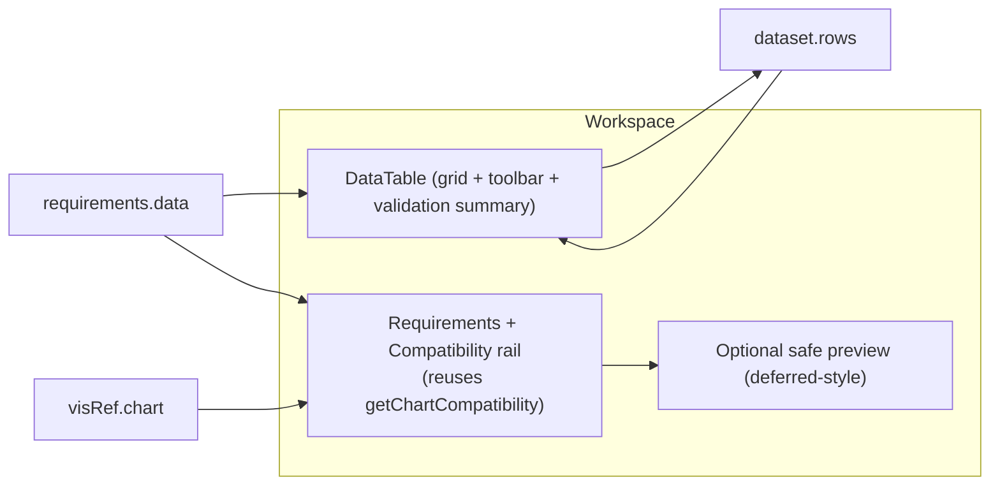

# ISC Creator — Step 4 (Choose Dataset) Audit & Design

> **Status:** audit + design proposal. **No code changes** accompany this document.
> **Audience:** designers + frontend architects implementing the Step 4 redesign in
> phased PRs.
> **Companion docs:** [`ISC_CREATOR_ARCHITECTURE.md`](./ISC_CREATOR_ARCHITECTURE.md),
> [`ISC_STEP3_VISUALIZATION_ARCHITECTURE.md`](./ISC_STEP3_VISUALIZATION_ARCHITECTURE.md),
> [`UI_ARCHITECTURE.md`](./UI_ARCHITECTURE.md).
>
> Step 4 is the user's **first hands‑on contact with data**. Its job is to connect
> *indicator requirements → available data → visualization* into one understandable
> flow — not just present a spreadsheet. The five conceptual phases and the underlying
> data model stay; this document is about presentation, guidance, and validation.

---

## 1. Current implementation audit

### 1.1 Component hierarchy
```
dataset.jsx  (Step 4 — wrapped in WorkflowSection)
├─ DatasetSummary               # collapsed summary (a read-only DataTable preview)
└─ Collapse (open when active)
   ├─ DataTableManager
   │  ├─ TableSideBar           # vertical actions: Insert Column · Insert Rows · Upload CSV · Reset
   │  │   ├─ AddColumnDialog    # name + type + (#rows if empty) → writes requirements.data
   │  │   ├─ AddRowDialog       # #rows → appends dataset.rows (default values)
   │  │   ├─ ImportDialog → CsvImporter   # CSV upload → parse → requirements.data + dataset.rows
   │  │   └─ DeleteDialog (Reset)         # clears rows + columns + requirements.data
   │  ├─ DataGrid (@mui/x-data-grid)      # columns = dataset.columns, rows = paginated dataset.rows
   │  │   ├─ ColumnMenu  → Rename / Change type / Delete (per column)
   │  │   ├─ NoRowsOverlay                # "Create a new column to add data"
   │  │   └─ Footer                       # pagination, page size, delete selected rows
   └─ Next button               # unlock Visualization or Finalize
```

### 1.2 State flow — the key coupling
```mermaid
flowchart TD
  R["requirements.data\n(Step 1: name + data type per column)"] -->|orchestrator effect on [requirements.data]| C["dataset.columns\n(field=id, headerName, type, dataType, editable)"]
  AddCol["Step 4: Insert Column"] -->|writes| R
  CSV["Step 4: Upload CSV"] -->|columns →| R
  CSV -->|rows →| Rows["dataset.rows"]
  AddRow["Step 4: Insert Rows"] -->|appends| Rows
  EditCell["DataGrid inline edit"] -->|processRowUpdate| Rows
  Reset["Reset"] -->|clears| R
  Reset -->|clears| Rows
  C --> Grid["DataGrid render"]
  Rows --> Grid
```
**Crucial fact:** the table's **columns are derived from `requirements.data`** (Step 1's
declared data), rebuilt by the orchestrator whenever `requirements.data` changes. So
"Insert Column" / CSV import in Step 4 actually **mutate Step 1's requirements**, and
"Reset" clears them. **Columns = requirements.data (single source); rows = `dataset.rows`.**
This is powerful (one source of truth) but invisible to the user.

### 1.3 Models
- **`dataset`** = `{ file, rows[], columns[] }`.
- **Column** (`dataset.columns[i]`) = `{ field: <requirement id>, headerName, type: "string"|"number", dataType: { value, type, description }, editable, width, renderHeader }`.
- **Row** (`dataset.rows[i]`) = `{ id, [columnField]: value, … }`. Manually‑seeded values
  default to `"<header> <n>"` (string) or `0` (number).
- **Requirement** (`requirements.data[i]`) = `{ id, value: <name>, type: <DataTypes obj>, placeholder }`.

### 1.4 CSV upload
`CsvImporter` stores the chosen `.csv` file; `ImportDialog.handleUploadFile` runs
`Papa.parse(header:true, dynamicTyping:true)`, then:
- `cleanRowData` — **drops any row that has a falsy value** and adds a uuid.
- `changeDataType` — infers numeric vs categorical per column, sets `requirements.data`
  (columns) and `dataset.rows`.

### 1.5 Manual entry, reset, pagination, selection
- **Insert Column** (`AddColumnDialog`): name (dup‑checked) + type + (#rows when table is
  empty) → appends to `requirements.data`.
- **Insert Rows** (`AddRowDialog`): #rows → appends rows with default values.
- **Reset**: clears rows + columns + `requirements.data` (a `DeleteDialog`).
- **Pagination**: custom `Footer` (client‑side slice; page size 5/10/20/50; delete selected
  rows via checkbox selection).
- **Edit**: single‑cell inline edit (click to edit; `processRowUpdate` writes the row).

### 1.6 Validation, preview, summary, save
- **Validation:** essentially **none in Step 4**. The Next button is disabled only when
  `rows.length === 0 && columns.length === 0` (**both** empty) — so a table with columns but
  **zero rows passes**, and there is no type / empty‑cell / required‑column / chart‑
  compatibility check.
- **Preview:** there is **no chart preview** in Step 4 (Step 3 shows the static example;
  Finalize shows the live chart).
- **Summary (collapsed):** a read‑only `DataTable` of the current data.
- **Save/autosave:** `dataset` is part of the serialized ISC and the 5‑second
  `sessionStorage` autosave; no Step‑4‑specific persistence or backend call.

### 1.7 Defects & smells found (to fix, not now)
- 🔴 **CSV drops valid `0`/empty‑ish rows** — `cleanRowData` filters rows where *any* value
  is falsy, so a legitimate numeric **`0`** removes the whole row.
- 🔴 **Fragile numeric detection** — `every(row => Boolean(Number(row[col])))` treats a
  column containing `0` (or any non‑numeric) as **categorical**, and misclassifies on a
  single bad cell.
- 🟠 **Row/column key mismatch risk on CSV** — imported rows are keyed by column **name**
  while `dataset.columns` are keyed by **id** (rebuilt from `requirements.data`); worth
  verifying cells map correctly after import.
- 🟠 **Next enabled with 0 rows** (columns‑but‑no‑rows passes) — Finalize then guards
  separately, but Step 4 lets an empty dataset through.
- 🟠 **Seeded placeholder data** (`"Material 1"`, `0`) can be mistaken for real data and
  saved as‑is.
- 🟢 Side‑bar labels via `dangerouslySetInnerHTML`; icon‑only column‑menu discoverability;
  no requirements/compatibility context anywhere in Step 4.

---

## 2. Multi-perspective evaluation

### 2.1 Learning Analytics
Step 4 presents a **table**, not an explanation. It never shows *how the data satisfies
the indicator's requirements* or the **selected chart's needs** ("your Bar chart needs 1
categorical + 1 numerical column"). The deep link — columns *are* the Step‑1 requirements —
is invisible, so users don't learn *why* they're adding each column.

### 2.2 UX
- **Discoverability:** column actions hide behind a **header click → menu**; the side bar
  is icon‑first; nothing signals "edit a cell by clicking."
- **Information hierarchy:** one big grid; no sense of required vs optional vs missing.
- **Cognitive load:** the user must infer what data to enter and why.
- **Feedback:** add/delete show snackbars; **type/empty/required problems are silent**.
- **Empty state:** "Create a new column to add data" — generic, not tied to requirements.
- **Loading/errors:** CSV parsing has **no progress, no error report, no preview**; bad
  files fail quietly or import wrong types.
- **Navigation:** Next doesn't reflect whether the data actually supports the chart.

### 2.3 Data preparation
Manual entry, CSV import, column/row creation, inline edit, type selection, and naming all
exist — but a **non‑expert wouldn't understand the workflow**: which columns are needed,
what a "Categorical (ordinal)" type means here, why empty cells matter, or what a good
dataset looks like for *their* indicator. CSV import is opaque (no column mapping, no type
confirmation, no preview, no validation summary).

### 2.4 Enterprise SaaS (interaction quality, not parity)
Tools like **Power BI / Tableau Prep / Orange / KNIME** make data prep **guided and
legible**: a schema/field panel, type badges with inline change, an import wizard with
preview + type inference you can correct, and visible data‑quality cues. Step 4 today is
closer to a **bare editable grid** — capable, but it doesn't *guide* or *explain*.

---

## 3. Relationship with Step 3 (continuity)
Step 3 recommends/validates charts against `dataset.columns` using the precise
compatibility helper. Step 4 edits those very columns — yet shows **no requirements and no
compatibility**. The redesign should make Step 4 a **direct continuation of Step 3**:
- The **selected chart's required columns should be visible before/while editing** ("Bar
  chart needs: ✓ 1 categorical · ⚠ 1 numerical").
- **Requirements stay pinned** while the user edits.
- **Compatibility updates live** as columns/rows change (reuse `getChartCompatibility`).

---

## 4. Preview (discuss only)
A chart preview **should begin updating in Step 4** as the dataset changes — this is where
real data first exists, so a live preview is most meaningful here. Given the Step‑3 live‑
preview reliability issues (deferred), Step 4 should adopt the **same safe preview
foundation** (`preview-data.js` model + a guarded renderer, static fallback) rather than the
Finalize renderers (which mutate `visRef`). Treat it as **optional/secondary** to the table
and requirements until the shared preview is proven reliable. No implementation here.

---

## 5. Validation (audit + recommendation)
| Case | Today | Recommended |
|---|---|---|
| **Missing required columns** | not checked | Show "needs 1 more numerical column" tied to the chart; surface in a requirements panel. |
| **Wrong data types** | not checked vs chart | Flag a column whose type doesn't satisfy the chart; offer one‑click change‑type. |
| **Empty cells** | silent | Mark empty required cells; count them; warn before continue. |
| **Duplicate columns** | blocked on add only | Keep; also flag if introduced via CSV. |
| **Invalid values** (e.g. text in a numeric column) | silent | Inline cell error + count. |
| **CSV problems** (empty file, no header, all‑dropped rows, bad types) | silent/buggy | Import **preview + summary**: rows parsed/skipped, inferred types (editable), errors. Fix the `0`/empty‑row drop and numeric inference. |
| **Next enabled** | rows&&columns both empty | Enable when the dataset is **non‑empty and chart‑compatible**; otherwise explain what's missing (don't necessarily hard‑block — decide policy). |

Principle: validate **inline and explained**, never silent; mirror Step 3's "explain, don't
just gate" approach.

---

## 6. Educational guidance
Teach what makes a **good dataset for this indicator**:
- A pinned **"What your indicator needs"** panel (from the chart + Step‑1 requirements) with
  live ✓/⚠ status per required type.
- Plain‑language hints: what each **data type** means here; why **empty cells** break a
  chart; how many **rows** make a meaningful preview.
- An **empty state** that says *"Add the columns your indicator needs"* (not generic), with
  one‑click "add the missing column."

---

## 7. Future AI opportunities (no implementation)
- **Automatic column suggestions** from the goal/question/indicator (Step 1) and chart.
- **Automatic type detection** on CSV with confidence + easy correction.
- **CSV cleaning** (trim, blank handling, de‑dup, coercion) with a transparent change log.
- **Missing‑value suggestions** (impute / drop / flag) with explanation.
- **Column mapping** wizard (CSV headers → required columns).
- **Dataset quality score** (completeness, type validity, rows, chart‑readiness).
Keep all of it **advisory + explainable**, behind a stable interface, with deterministic
fallbacks.

---

## 8. Target architecture

**Principle:** a **two‑pane data workspace** — the table where work happens, plus a pinned
**requirements + compatibility** rail that ties the data back to the chart and (optionally)
a live preview. Guided, legible, validated; the underlying `dataset`/`requirements.data`
model unchanged.

```
┌───────────────────────────────────────────────────────────────────────┐
│ Choose dataset                                                          │
│ Enter or import the data your indicator needs.                          │
├──────────────────────────────────────────┬────────────────────────────┤
│ DATA TABLE                                │ WHAT YOUR INDICATOR NEEDS   │
│  toolbar: Add column · Add rows · Import  │  ✓ 1 categorical (Material) │
│           CSV · Reset                     │  ⚠ 1 numerical (add one)    │
│  ┌──────────────────────────────────────┐ │  Compatibility: Needs data  │
│  │ grid w/ type badges in headers,      │ │                             │
│  │ inline edit, empty/invalid cell flags│ │  PREVIEW (optional, safe)   │
│  └──────────────────────────────────────┘ │  [sample/live or static]    │
│  validation summary: 0 empty · 0 invalid  │                             │
├──────────────────────────────────────────┴────────────────────────────┤
│ [Back]                                   validation note     [Next →]   │
└───────────────────────────────────────────────────────────────────────┘
```



### Current → Proposed
| Dimension | Current | Proposed |
|---|---|---|
| Framing | Bare editable grid | Two‑pane **data workspace** |
| Requirements | Invisible | **Pinned panel** (required types, live ✓/⚠) |
| Continuity w/ Step 3 | None | Chart needs visible; **live compatibility** |
| Toolbar | Icon side bar (`dangerouslySetInnerHTML`) | Clear labelled toolbar; column type badges + inline change |
| CSV | Opaque, buggy | **Import preview + type confirm + error summary**; fixed drops/inference |
| Validation | Silent / minimal | **Inline + summarized** (empty, invalid, missing, dup) |
| Preview | None | Optional safe live/sample preview |
| Empty state | Generic | **Requirement‑aware** ("add the columns you need") |

### Trade-offs
- A live preview in Step 4 adds cost + the same sizing pitfalls seen in Step 3 → reuse the
  **deferred‑safe** approach; keep it secondary.
- A requirements rail consumes horizontal space → collapsible on smaller screens.
- Fixing CSV inference/`0`‑drop is a **behavior change** (more rows kept, different types) →
  flag and verify against saved ISCs.
- "Insert Column mutates Step‑1 requirements" should be made **explicit** (a note), not
  changed — it's the intended single‑source model.

---

## 9. Implementation roadmap (safe phases)
| Phase | Scope | Why here |
|---|---|---|
| **4A — Workspace architecture** | Wrap existing table in a two‑pane layout (table + rail placeholder); no logic change; clean up the icon side bar into a labelled toolbar; accessibility pass on actions. | Frame first, lowest risk, no data behavior change. |
| **4B — Requirements panel** | Pinned "What your indicator needs" rail reusing `getChartCompatibility` (required types, live ✓/⚠, missing). Read‑only. | The core continuity win; pure read of existing helper/state. |
| **4C — Spreadsheet redesign** | Type badges in headers + inline change‑type, clearer edit affordance, requirement‑aware empty state, calmer column menu. | Builds on the frame; no model change. |
| **4D — CSV workflow** | Import **preview + inferred‑type confirmation + error/skip summary**; fix the `0`/empty‑row drop and numeric inference; explicit "replaces dataset" + column‑mapping. | Highest‑risk data path — isolate it after the frame/rail exist. |
| **4E — Validation** | Inline empty/invalid/missing/duplicate flags + a validation summary; decide Next policy (compatible vs explained). Reuse the helper. | Depends on the rail (4B) + grid (4C). |
| **4F — Live preview integration** | Adopt the shared safe preview (sample/live + static fallback) as a secondary pane, updating as data changes. | Last of the features; depends on a proven preview foundation. |
| **4G — Accessibility & polish** | Keyboard for grid/toolbar/dialogs, labels, announcements for validation/compatibility, responsive collapse of the rail, reduced motion. | Final hardening once structure is settled. |

**Why this order:** establish the **frame + accessible toolbar** (4A) before touching data
behavior; deliver the **requirements continuity** (4B) as a pure, safe read; improve the
**grid** (4C); then isolate the **riskiest path — CSV** (4D) with a real preview/validation;
layer **dataset validation** (4E); add the **preview** (4F) only once it's reliable; finish
with **a11y/polish** (4G). Each phase is independently shippable and preserves the
`dataset`/`requirements.data` model and save behavior.

---

## 10. Risks & invariants (carry into implementation)
- **Preserve** the `dataset` shape, the `requirements.data ⇄ dataset.columns` derivation,
  chart compatibility, save/draft/serialization, and edit‑existing‑ISC behavior.
- **CSV fixes are behavior changes** (keep `0`/empty handling correct; better type
  inference) — flag and verify against saved ISCs and the row‑key‑by‑name vs column‑id
  concern.
- Make the **"Insert Column edits Step‑1 requirements"** coupling explicit; don't silently
  break it.
- Any **preview** must reuse the safe, deferred‑style foundation (never the Finalize
  renderers, which mutate `visRef`); it must never blank the panel.
- Keep validation **advisory + explained**; decide the Next‑gating policy deliberately
  (today it under‑gates).
- AI features stay **advisory + explainable** behind a stable interface.

---

*Design document only. Update alongside the Step 4 phases (4A–4G) as they land, and keep it
consistent with `ISC_CREATOR_ARCHITECTURE.md`.*
