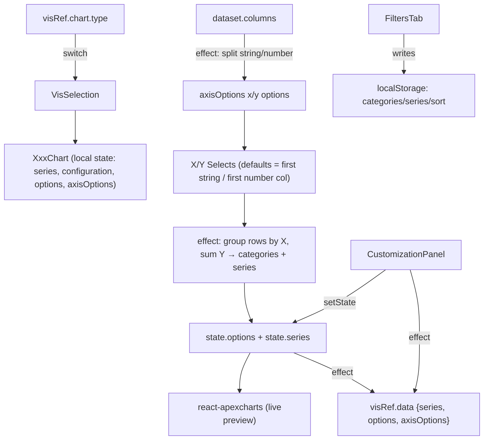
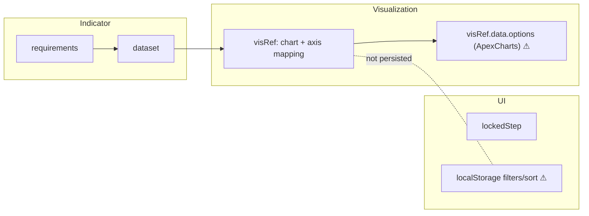
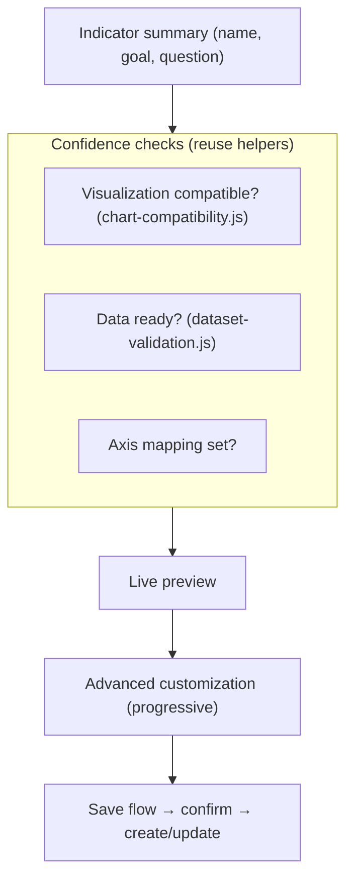

# ISC Creator — Step 5 (Finalize Indicator) Audit & Design

> **Status:** audit + design proposal. **No code changes** accompany this document.
> **Audience:** designers + frontend architects implementing the Step 5 redesign in
> phased PRs.
> **Companion docs:** [`ISC_CREATOR_ARCHITECTURE.md`](./ISC_CREATOR_ARCHITECTURE.md),
> [`ISC_STEP3_VISUALIZATION_ARCHITECTURE.md`](./ISC_STEP3_VISUALIZATION_ARCHITECTURE.md),
> [`ISC_STEP4_DATASET_ARCHITECTURE.md`](./ISC_STEP4_DATASET_ARCHITECTURE.md),
> [`UI_ARCHITECTURE.md`](./UI_ARCHITECTURE.md).
>
> Step 5 is the **last** step. Today it is effectively a **chart editor**: pick axes,
> open a customization panel, tweak the ApexCharts config, then save. The redesign goal
> is to turn it into **"Finalize your learning analytics indicator"** — a confident close
> to the workflow that confirms the indicator is complete and answers the research
> question. Every conclusion below is grounded in the current code.

---

## 1. Current implementation audit

### 1.1 Component hierarchy
```
finalize.jsx  (Step 5 — wrapped in WorkflowSection)
├─ FinalizeSummary            # header row only (chip/lock + "Finalize Indicator" + tip + toggle)
└─ Collapse (open when active)
   ├─ VisSelection            # switch on visRef.chart.type → one of 10 chart components
   │  └─ <XxxChart customize handleToggleCustomizePanel/>   # e.g. BarChart (~524 lines)
   │     ├─ X-Axis / Y-Axis  <Select>  (+ ChartAxisDropdownFeedback)
   │     ├─ "Customize" button
   │     ├─ <Chart/> (react-apexcharts) — preview (rendered twice: full vs. 8-col)
   │     └─ CustomizationPanel (when customize)
   │        ├─ ElementsTab → Legends · Axis · Title · Labels
   │        ├─ StylesTab   → colors (reads live ApexCharts instance)
   │        └─ FiltersTab  → category filter + sort  (only some charts)
   ├─ Save / Update button   # disabled when dataset has no rows/columns
   └─ NameDialog             # confirm-save dialog (does NOT name; name comes from Step 1)
```
There are **10 near-identical chart components** (`bar`, `line`, `pie`, `polar`, `radar`,
`scatter`, `stackedBar`, `dot`, `groupedBar`, `treemap`), each ~470–595 lines — **~6,560
lines total** in `finalize/`. `VisSelection` is a `switch` that mounts one of them.

### 1.2 Render & state flow

Each chart owns a **large local `state`**: `series`, a `configuration` object (~30 boolean
capability flags), `options` (a **complete ApexCharts options object**), and `axisOptions`.
A chain of `useEffect`s keeps `state` ↔ `visRef.data` in sync, derives axis option lists
from `dataset.columns` (by coarse `col.type` `"string"`/`"number"`), and aggregates
`dataset.rows` (group-by X, sum Y) into chart series.

### 1.3 `visRef` responsibilities (what the "Visualization" owns)
From the default in `indicator-specification-card.jsx` and the chart components:
- `visRef.filter.type` — analytical task (Step 3).
- `visRef.chart` — `{ type, code, … }` selected chart (Step 3).
- `visRef.data.series` — computed ApexCharts series (`[{name, data, color}]`).
- `visRef.data.options` — **the entire ApexCharts options object** (chart/title/subtitle/
  plotOptions/dataLabels/xaxis/yaxis/legend/tooltip/markers/colors…).
- `visRef.data.axisOptions` — `selectedXAxis`, `selectedYAxis`, the x/y option lists, and
  the per-chart label/value/category option arrays.
- `visRef.edit` — transient flag: `true` when loading a saved ISC, flipped to `false` by
  the chart effects after the first hydration.

### 1.4 Chart rendering & configuration architecture
- Rendering is **react-apexcharts** (`<Chart options series type/>`), one of two `<Grow>`
  branches: a full-width preview when not customizing, an 8-column preview + 4-column
  panel when customizing. **Two `<Chart/>` instances exist in the tree per chart** (only
  one visible at a time via `<Grow unmountOnExit>`).
- Configuration is driven by the per-chart `configuration` flag object; `CustomizationPanel`
  reads those flags to decide which tabs/controls to show.
- `StylesTab` reaches into the **live ApexCharts instance** (`ApexCharts.getChartByID(...)`)
  to read current colors — a direct coupling to the rendering library beyond React state.

### 1.5 Axis mapping
- `dataset.columns` are split by coarse type: `string` → X options, `number` → Y options.
- Defaults: first string column → X, first number column → Y.
- UI: two MUI `<Select>`s labelled **"X-Axis" / "Y-Axis"** with a `ListSubheader`
  ("Categorical column(s)" / "Numerical column(s)") and an error state +
  `ChartAxisDropdownFeedback` when empty.
- Multi-axis charts (scatter, treemap, stacked/grouped) carry extra option arrays
  (`labelOptions`, `barValueOptions`, `categoryOptions`, `xValueOptions`, `valueOptions`).

### 1.6 Preview generation
- The preview is **live** (real ApexCharts), unlike Step 3's static image (deferred there).
- Series are built by **grouping rows by the X value and summing Y**
  (`acc[xValue] += row[selectedYAxis] || 0`). Empty/invalid Y coerces to `0`.
- `minHeight: 600`; re-renders on dark-mode change via a dedicated effect per chart.

### 1.7 Customization panel
- `CustomizationPanel` → `TabContext` with tabs `["elements", "style"]` plus `"filters"`
  when `isSortingOrderChangeable || isCategoriesFilteringAvailable` (and not line).
- **ElementsTab:** Legends (show/position/colors), Axis (show/hide axes + titles),
  Title (title/subtitle text + position), Labels (data labels + background).
- **StylesTab:** series colors (single/multiple), reading the live chart instance.
- **FiltersTab:** category multi-select filter + asc/desc sort.

### 1.8 Renderer lifecycle
- On mount, `options` initializes from `visRef.data.options` **if `visRef.edit`**, else from
  a hard-coded default options literal.
- Effects then: (a) recolor on dark mode; (b) rebuild axis option lists from `dataset`
  and **write them back to `visRef` + set `edit:false`**; (c) reconcile selected axes
  (honoring `visRef.edit` saved selections); (d) aggregate rows → series/categories and
  push to `visRef.data`. So the renderer **mutates `visRef` during render effects**.

### 1.9 Persistence, save/update, autosave, localStorage, payload
- **Save/Update:** `NameDialog` → `requestCreateISC` (`POST v1/isc/create`) or
  `requestUpdateISC` (`PUT v1/isc/{id}`). Body = `{ requirements, dataset, visRef,
  lockedStep }`, **each `JSON.stringify`'d**. On success: snackbar, `removeItem(SESSION_ISC)`,
  `navigate("/isc")`.
- **Autosave:** the orchestrator writes `{ id, requirements, dataset, visRef, lockedStep }`
  to `sessionStorage[SESSION_ISC]` every 5 s (draft only — never hits the backend).
- **localStorage:** `FiltersTab` reads/writes **`categories`, `series`, `sort`** — these are
  **app-global keys, NOT part of `visRef`/the payload**, so category-filter and sort
  choices are **not saved** with the indicator and **leak across ISCs** (we already clear
  them on a path change; see `isc-workflow-reset.js`).
- **Backend payload:** four stringified JSON fields; `lockedStep` is `@NotBlank` mandatory.
  `visRef` carries the **entire ApexCharts options object**.

### 1.10 Edit & update workflow
- The dashboard (`my-isc-table.jsx`, `isc-preview.jsx`) loads a saved ISC into
  `sessionStorage[SESSION_ISC]`, sets **`parsedData.visRef.edit = true`**, and navigates to
  the creator with a route `:id`. The chart components use `visRef.edit` to restore saved
  `options`/axis selections, then flip `edit:false`.
- The Step 5 button reads `useParams().id` to label **"Update indicator"** vs **"Save
  indicator"**; `NameDialog` switches create vs. update on `Boolean(id)`.

---

## 2. Multi-perspective evaluation

### 2.1 Learning Analytics
Step 5 **mostly exposes chart configuration**, not indicator finalization. There is no
restatement of the **goal / question / indicator name** (all defined in Step 1), no
confirmation that the chosen **visualization answers the question**, and no summary of
**what data backs it**. A researcher prototyping an indicator gets an ApexCharts editor,
not a "here is your indicator" close.

### 2.2 UX
Users understand **chart settings** (axes, colors, legend) but not **what they are
finalizing**. `FinalizeSummary` is a misnomer — it is only a header row (chip + title +
tip + expand toggle); it summarizes nothing. There is **no pre-save summary** and **no
sense of "this is the indicator that will be saved."** The save dialog confirms but the
component is called `NameDialog` while **no naming happens here** (the name comes from
Step 1), which is confusing.

### 2.3 Visualization
- **Chart selection:** reused from Step 3 (`VisSelection` switch on `visRef.chart.type`).
- **Axis mapping:** functional but uses chart terms ("X-Axis"/"Y-Axis") rather than
  learning-analytics terms (category/measure); defaults to first columns; validates empties.
- **Customization:** powerful but **overwhelming** — ~30 capability flags, 3 tabs, and
  many controls, all presented flat (not progressive).
- **Preview:** live and immediate (a strength), but rendered as **two `<Chart/>`
  instances** and tightly coupled to the per-chart options state.
- **Discoverability:** customization is one "Customize" button; the category filter/sort
  hide in a third tab that only appears for some charts.
- **Workflow:** "configure chart → save" — no checkpoint that the indicator is complete.

### 2.4 Enterprise SaaS
It feels like **"open a chart editor"**, not **"finish your work."** A finalize step in a
SaaS tool typically shows a **review/summary**, a **confidence check**, and a **clear,
explained save** — none of which exist here. The 10 duplicated ~500-line chart files also
signal heavy technical debt behind the editor.

---

## 3. Current weaknesses (only those that exist in the code)
- 🔴 **No indicator summary before saving.** `FinalizeSummary` is a header, not a summary;
  nothing restates goal/question/name/chart/dataset.
- 🔴 **`visRef` owns too much.** `visRef.data.options` is the **entire ApexCharts options
  object** — chart-library structure is persisted to the backend, coupling saved ISCs to
  ApexCharts' schema.
- 🔴 **Massive renderer duplication.** 10 chart components (~6,560 lines) repeat the same
  effects, defaults, dark-mode handling, axis logic, and dual-preview markup.
- 🟠 **Customization is not progressive.** ~30 flags + 3 tabs + color/legend/axis/title/
  labels shown flat; essential vs. advanced not separated.
- 🟠 **Filters/sort are not persisted and leak.** `categories`/`series`/`sort` live in
  app-global `localStorage`, outside `visRef` — not saved with the indicator, shared
  across ISCs.
- 🟠 **Chart-library terminology leaks** into the UI ("X-Axis"/"Y-Axis") and the payload.
- 🟠 **Save gating ignores data quality.** `handleCheckDisabled` only checks
  `rows.length`/`columns.length` (not the Step 4F validation), so an indicator with
  invalid/empty cells can still be saved.
- 🟠 **`NameDialog` doesn't name.** Naming happens in Step 1; the dialog only confirms,
  yet is named/`titled` around naming.
- 🟢 **Renderer mutates `visRef` during render effects** and flips a transient `edit` flag —
  fragile lifecycle that's hard to reason about.
- 🟢 **Preview rendered twice** per chart (full vs. customizing branches).
- 🟢 **`StylesTab` reaches into the live ApexCharts instance** (`getChartByID`) — coupling
  beyond React state.

---

## 4. State architecture

| Slice | Belongs to | Contents | Notes |
|---|---|---|---|
| `requirements` | **Indicator** | goal, question, indicatorName, data (columns), selectedPath | The research substance; surfaced in Step 1 only. |
| `dataset` | **Indicator (data)** | file, rows, columns | Columns derived from `requirements.data`; backs the chart. |
| `visRef` | **Visualization** | filter, chart, data.series, **data.options (ApexCharts)**, data.axisOptions, edit | Mixes *indicator-level* choices (chart, axis mapping) with *render-level* config (full ApexCharts options) + a *UI* flag (`edit`). |
| `lockedStep` | **UI state** | per-phase {locked, openPanel, step} | Legacy step codes persisted (mandatory). |
| `localStorage` categories/series/sort | **UI/transient** | filter + sort | Outside the payload; leaks across ISCs. |

**Coupling to untangle:**
- `visRef.data.options` conflates *indicator intent* (title, axis labels) with *render
  detail* (tooltip theme, marker colors, plotOptions). The persisted indicator should not
  depend on ApexCharts' object shape.
- Chart components both **read and write** `visRef` inside effects, and derive axis options
  from `dataset.columns` by coarse type — duplicated 10×.
- Filter/sort state lives in three places (component state, `localStorage`, and *not* in
  `visRef`), so it can't round-trip on save.



---

## 5. Customization architecture — triage
| Control | Group | Verdict |
|---|---|---|
| Title / subtitle text | Elements | **Essential** — part of the indicator's meaning. |
| Axis titles (labels for X/Y) | Elements | **Essential** — name the measure/category. |
| Series color(s) | Styles | **Progressive** — one accent color essential; per-series palette = advanced. |
| Legend show/position | Elements | **Progressive** — sensible default; reveal on demand. |
| Data labels + background | Labels | **Advanced** — rarely needed for a prototype. |
| Axis show/hide | Axis | **Advanced.** |
| Category filter | Filters | **Progressive** — useful, but should persist (currently doesn't). |
| Sort asc/desc | Filters | **Progressive** — should persist. |
| Tooltip theme / markers / plotOptions | (inside options) | **Advanced / hidden** — render detail, not indicator intent. |

Principle: a **calm default** (title, axis labels, one accent color, legend on) with an
**"Advanced" disclosure** for the rest, mirroring Step 3's progressive approach.

---

## 6. Axis mapping evaluation
- **Discoverability:** two labelled Selects are visible immediately — adequate.
- **Defaults:** first string → X, first number → Y. Reasonable, but silent.
- **Validation:** empty axis → error state + `ChartAxisDropdownFeedback` message. Good.
- **Compatibility:** options come straight from `dataset.columns` by coarse type; there is
  no link back to the Step 3 chart requirements beyond the string/number split.
- **Interaction:** **beginners** face chart jargon ("X-Axis", "Y-Axis"); **experts** can
  work but multi-axis charts spread state across many option arrays.
- Recommendation: relabel to **learning-analytics language** ("Category (horizontal)",
  "Measure (vertical)") with the chart term as secondary, and reuse the Step 3/4
  compatibility helper to validate the mapping.

---

## 7. Saving — what is actually saved, and is it understandable?
- **Saved:** `{ requirements, dataset, visRef, lockedStep }` (four stringified JSON
  fields). The **whole indicator** (research + data + visualization + workflow position).
- **NOT saved:** category filter / sort (localStorage only).
- **Create vs. Update:** chosen by `Boolean(id)`/`useParams().id`.
- **Autosave:** draft to `sessionStorage` every 5 s; cleared on successful save.
- **Understandability:** **low.** The user never sees the bundle they're saving; the dialog
  ("Save Indicator? … make it available from My ISCs") is a confirm, not a review. There is
  no name field here (name is from Step 1), and no summary of what "the indicator" is.

---

## 8. Target vision — "Finalize your indicator"

**Principle:** Step 5 becomes a **review-and-confirm** close, not a chart editor. It answers,
in order: *Is my indicator complete? Can it answer my research question? Is the
visualization appropriate? Does the data support it? Can I confidently save it?* The chart
editor stays available, but **demoted to progressive disclosure** behind a confident
summary + preview.

```
┌───────────────────────────────────────────────────────────────────────┐
│ Finalize your indicator                                                 │
│ Review everything below, then save.                                     │
├──────────────────────────────────────────┬────────────────────────────┤
│ INDICATOR SUMMARY                          │ PREVIEW                     │
│  Name:      <indicatorName>                │  [ live chart ]             │
│  Goal:      <goal>                         │                             │
│  Question:  <question>                     │  Category: <X>  Measure: <Y>│
│  Visualization: <chart>  ✓ compatible      │                             │
│  Data:      <N rows · M columns> ✓ ready   │  [ Adjust chart ▸ ]         │
│  Answers the question?  ✓ /  ⚠ check       │                             │
├──────────────────────────────────────────┴────────────────────────────┤
│ ▸ Advanced chart customization (axes, colors, legend, labels, filters)  │
├─────────────────────────────────────────────────────────────────────────┤
│ readiness note                                  [Back]   [Save indicator]│
└─────────────────────────────────────────────────────────────────────────┘
```



### Proposed sections
1. **Header:** "Finalize your indicator" + one-line intent.
2. **Indicator summary:** name, goal, question, selected visualization, dataset size — read
   from `requirements`/`visRef`/`dataset` (no new state).
3. **Confidence checks:** compatible (reuse `getChartCompatibility`), data ready (reuse
   `validateDataset` from 4F), axis mapping complete — each ✓/⚠ with a one-line reason.
4. **Preview:** the existing live chart, single instance, with the axis mapping shown as
   "Category / Measure".
5. **Advanced customization:** the current panel, moved behind a disclosure; reorganized
   into Essential (title, axis labels, accent color) vs. Advanced (legend, labels, filters,
   colors).
6. **Save flow:** a summary-aware confirm dialog that states exactly what is saved and
   where it goes; gate on the 4F readiness, not just row/column counts.

### Information hierarchy & progressive disclosure
Summary + checks first (answer "is it done?"), preview second, **chart editing last**
(opt-in). Essential customization inline; everything else in an "Advanced" group.

### Save flow & confirmation
- Disable Save until: data **ready** (4F), a chart selected, and axis mapping complete.
- Confirm dialog restates the indicator name + that it will appear in **My ISCs**, and
  whether this is a **create** or **update**.
- Persist filter/sort **inside `visRef`** so they round-trip (removing the localStorage
  leak) — without changing the four-field payload contract.

### Future AI opportunities (no implementation)
- **Question-fit check:** does the chosen chart + mapping actually answer the Step 1
  question? Suggest a better chart/mapping if not.
- **Auto title/subtitle** from goal + question.
- **Narrative summary:** a one-paragraph plain-language description of the indicator.
- **Anomaly hints** in the preview (flat/empty series, single category, all-zero measure).
All advisory, explainable, behind a stable interface.

---

## 9. Implementation roadmap (ordered by risk & dependency)
| Phase | Scope | Why here / dependency |
|---|---|---|
| **5A — Overall layout** | Introduce the finalize workspace frame (summary region + preview + advanced disclosure placeholder); no logic change; keep the existing chart component mounted inside. | Lowest risk; establishes structure before touching renderers. |
| **5B — Summary redesign** | Replace the header-only `FinalizeSummary` with a real indicator summary (name/goal/question/chart/data) reading existing state; add confidence checks reusing `getChartCompatibility` + `validateDataset`. | Pure reads; high value; depends only on the 5A frame. |
| **5C — Axis mapping** | Relabel to learning-analytics terms (Category/Measure), keep the Selects + validation; surface mapping in the summary/preview. | Localized to the axis UI; no payload change. |
| **5D — Customization redesign** | Progressive disclosure: Essential (title, axis labels, accent color) inline; Advanced (legend, labels, filters, palette) behind a disclosure. Persist filter/sort **into `visRef`** (remove localStorage leak). | Depends on 5A/5B; touches the panel + filters state — medium risk. |
| **5E — Preview architecture** | Single preview instance; begin extracting shared chart logic (one renderer fed by a small descriptor) to retire the 10 duplicated files incrementally. | Highest technical risk (touches all charts); do after UX is settled so visuals are stable while refactoring. |
| **5F — Save experience** | Summary-aware confirm dialog; gate Save on 4F readiness + chart + axis mapping; clarify create vs. update; rename `NameDialog` to its real role. | Depends on 5B checks; changes gating (behavioral) — isolate. |
| **5G — Accessibility** | Headings, keyboard for disclosures/tabs/dialog, focus management, status not color-only, labelled controls. | Final hardening once structure settles. |
| **5H — Technical cleanup** | Stop persisting the full ApexCharts options; define a slim, library-agnostic visualization config (with a migration in `isc-serialization.js`); remove `visRef` render-time mutation and the transient `edit` flag where possible. | Most invasive + serialization-sensitive; last, behind a migration. |

**Why this order:** frame (5A) → meaning/summary (5B) → clearer mapping (5C) → tamed
customization (5D) → consolidate rendering (5E) → trustworthy save (5F) → a11y (5G) → the
deep payload/coupling cleanup (5H) last, because it touches serialization and every chart.

---

## 10. Risks & invariants (carry into implementation)
- **Serialization is the biggest risk.** Saved ISCs persist `visRef` (incl. the full
  ApexCharts `options`) as a stringified field. Any change to `visRef`'s shape **must** go
  through `isc-serialization.js` with a migration and must keep the **four-field payload**
  (`requirements`, `dataset`, `visRef`, `lockedStep`) and the **mandatory `lockedStep`**
  intact. Don't break existing saved indicators.
- **Must never change:** the create/update endpoints (`POST v1/isc/create`, `PUT
  v1/isc/{id}`), the stringified-JSON body contract, `lockedStep` legacy step codes, and
  the autosave draft format.
- **Coupling / debt to unwind carefully:** 10 duplicated chart files; `visRef` owning the
  ApexCharts options; `StylesTab` reading the live chart instance; render-time `visRef`
  mutation + the `edit` flag; filter/sort in app-global `localStorage`.
- **Edit workflow:** the dashboard sets `visRef.edit = true` before navigating; any
  renderer refactor (5E/5H) must preserve restore-on-edit of saved axis/options.
- **Behavioral change to flag:** gating Save on 4F readiness (5F) is stricter than today's
  row/column check — intended, but call it out.
- **Preview reliability:** Step 5's preview is live ApexCharts (unlike Step 3's deferred
  static). Consolidating the renderer (5E) must not reintroduce the blank-chart issues
  documented in the Step 3 doc.

---

*Design document only. Update alongside the Step 5 phases (5A–5H) as they land, and keep it
consistent with `ISC_CREATOR_ARCHITECTURE.md`.*
