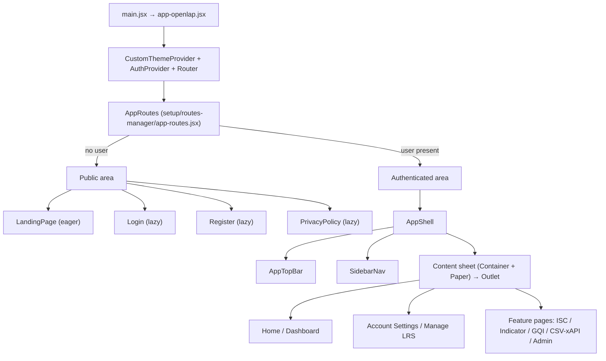
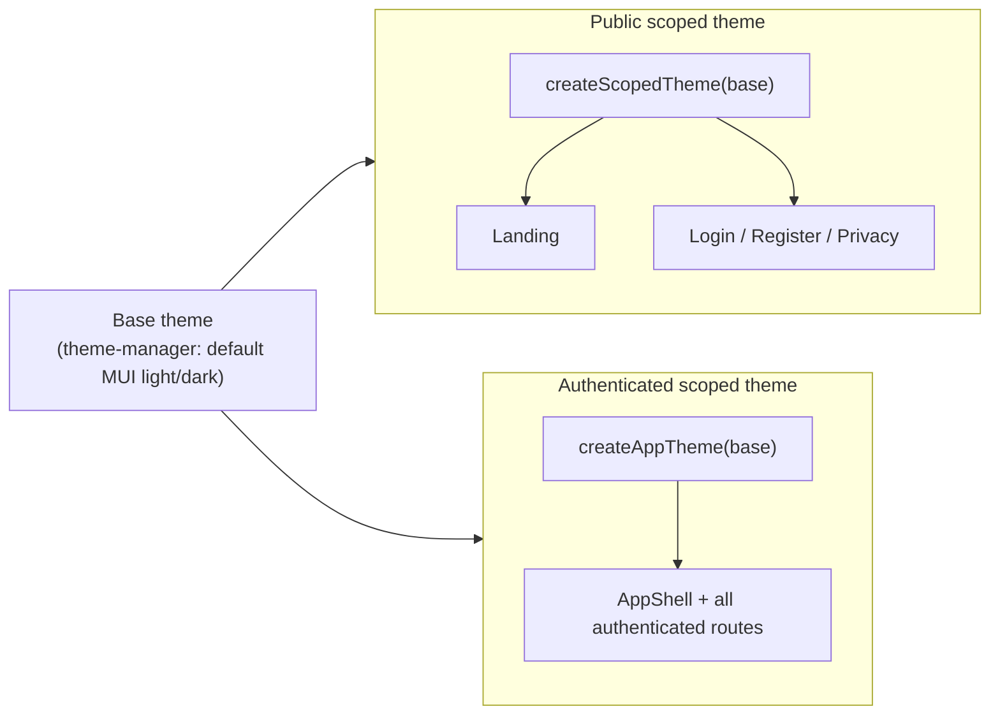
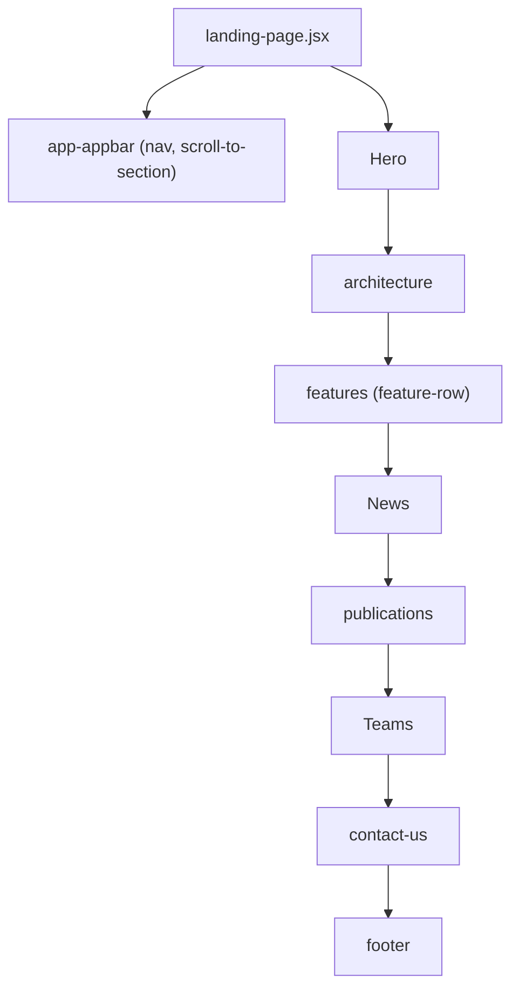
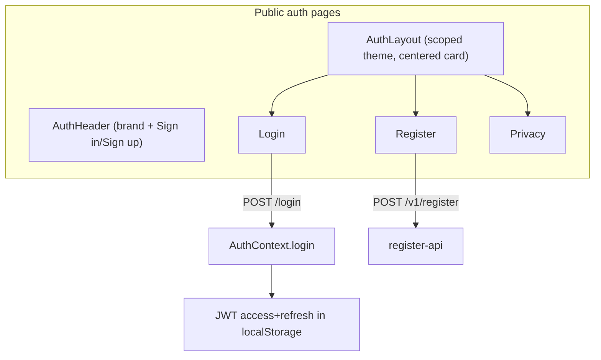
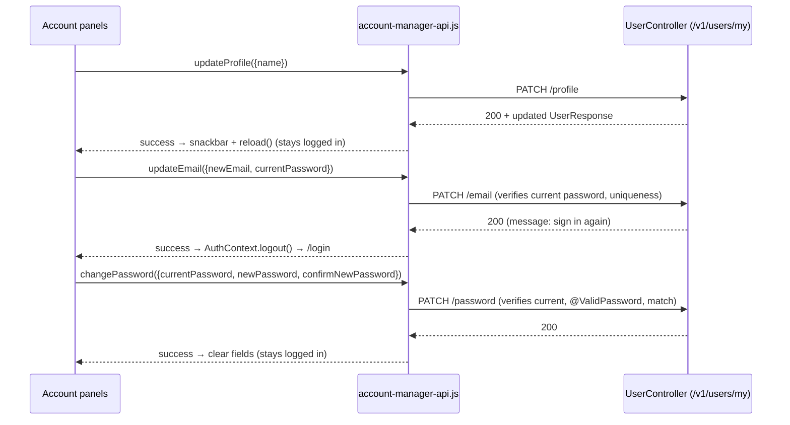
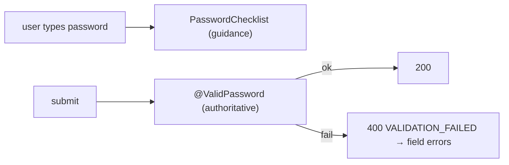

# OpenLAP Indicator Editor — UI Architecture

> Developer-facing architecture reference for the frontend modernization effort.
> Audience: developers continuing this project. This document explains **what**
> exists, **how** it fits together, and **why** the decisions were made, so new
> work stays consistent with the established conventions.
>
> Stack: **React 18.3 + Vite 7**, **MUI v7** (`@mui/material`, `@mui/icons-material`,
> `@mui/lab`, `@mui/system`), Emotion, `react-router-dom` v7, `notistack`,
> `@fontsource/inter`. Backend: `openlap-analyticsframework` (Java 11, Spring Boot 2.x).

---

## Table of contents
1. [Purpose](#1-purpose)
2. [High-level UI Architecture](#2-high-level-ui-architecture)
3. [Theme Architecture](#3-theme-architecture)
4. [Folder Architecture](#4-folder-architecture)
5. [Shared Component Library](#5-shared-component-library)
6. [Navigation Architecture](#6-navigation-architecture)
7. [Public Page Architecture](#7-public-page-architecture)
8. [Authentication Architecture](#8-authentication-architecture)
9. [Account Management Architecture](#9-account-management-architecture)
10. [Password Policy](#10-password-policy)
11. [Reusable Hooks](#11-reusable-hooks)
12. [Motion System](#12-motion-system)
13. [Accessibility Standards](#13-accessibility-standards)
14. [Error Handling](#14-error-handling)
15. [Performance Strategy](#15-performance-strategy)
16. [Design Principles](#16-design-principles)
17. [Future Development Guidelines](#17-future-development-guidelines)
18. [Remaining Technical Debt](#18-remaining-technical-debt)
19. [Recommended Roadmap](#19-recommended-roadmap)

---

## 1. Purpose

### Why the redesign was performed
OpenLAP's frontend had grown organically: the public landing page and the
authenticated application both rendered with the **default MUI theme** (Roboto,
uppercase buttons, flat surfaces), used **ad‑hoc per‑page layout** (duplicated
breadcrumb/divider wrappers, repeated data‑fetch state), carried **latent bugs**
(an undefined `navigate`, a crash on "copy basic auth", a loading state that never
cleared on error), and had **accessibility gaps** (missing `h1`s, unlabeled icon
buttons, an incorrect nav landmark). The redesign modernizes the product into a
clean, professional **SaaS/enterprise** experience without changing business logic.

### Design philosophy
Calm, professional, content‑first. Soft elevation over heavy borders, generous but
consistent spacing, a restrained accent, and **no flashy motion**. The UI should
feel like a focused analytics workbench, not a marketing site.

### Goals
- **Target UX** — modern enterprise SaaS: a fixed app shell, a clear "start here"
  dashboard, scannable resource pages, and predictable settings.
- **Maintainability** — a small library of reusable primitives; data‑driven pages;
  tokens instead of magic numbers; no duplicated layout markup.
- **Scalability** — navigation, dashboard, and lists are config/data‑driven so they
  grow without JSX churn; the shell supports many nav items.
- **Accessibility** — correct heading hierarchy, labeled controls, keyboard support,
  visible focus, and reduced‑motion support, applied as a baseline everywhere.
- **Consistency** — one design system, one set of primitives, one theme per area.

---

## 2. High-level UI Architecture

The app splits cleanly into a **public area** (anonymous visitors) and an
**authenticated area** (logged‑in users), chosen at the router based on the
presence of a decoded user.



### Public vs authenticated layout separation
- **Public pages** use their own **scoped theme** (`createScopedTheme`) applied via a
  nested `ThemeProvider`, and a centered **`AuthLayout`** for the auth pages.
- **Authenticated pages** are wrapped by **`AppShell`**, which applies the
  **authenticated scoped theme** (`createAppTheme`) and renders the top bar, sidebar,
  and a content "sheet" hosting the routed `<Outlet/>`.
- The two areas never share a layout wrapper, so changes to one cannot regress the
  other. Both inherit the same base light/dark palette from `CustomThemeProvider`.

Routing is defined in [`setup/routes-manager/app-routes.jsx`](../src/setup/routes-manager/app-routes.jsx).
Authenticated routes are children of a single element that renders
`AppShell → Container(maxWidth="xl") → Paper (content sheet) → Outlet`, plus a
`Footer`. All route components except the landing page are `React.lazy` + `Suspense`.

---

## 3. Theme Architecture

Three layers, applied with **nested `ThemeProvider`s** so each area is isolated.



### The base theme
[`setup/theme-manager/theme-context-manager.jsx`](../src/setup/theme-manager/theme-context-manager.jsx)
provides `CustomThemeContext` with `{ darkMode, toggleDarkMode, handleLightMode, theme }`.
`theme` is a **plain default MUI** light/dark theme (mode only). It is the global
`ThemeProvider` value in `AppRoutes`. Everything else **layers on top of this base**.

### `createScopedTheme(base)` — public design system
[`common/theme/scoped-theme.js`](../src/common/theme/scoped-theme.js). Layers the
shared design foundation onto the base and exposes design tokens under
`theme.custom.*`. Applied to **landing + auth** pages via nested `ThemeProvider`.

### `createAppTheme(base)` — authenticated app
[`common/theme/app-theme.js`](../src/common/theme/app-theme.js). **Inherits**
`createScopedTheme` (so the app and public pages share the same foundation), then:
- sets a **soft canvas** `background.default` (`#f5f6f8` light; MUI default dark), and
- **neutralizes the public theme's card hover‑lift** (existing feature‑page cards must
  not gain undesigned motion).

### Why a global theme was avoided
The authenticated theme wraps **all** authenticated routes — including the not‑yet‑
redesigned feature pages (ISC/Indicator/GQI/CSV‑xAPI) with their charts, data grids,
and editors. Applying a heavy theme globally risked silently restyling/breaking those.
The chosen approach keeps overrides **conservative** (typography, radii, button/input/
chip/dialog polish) and styles the shell itself via **component `sx`**, never via
global component overrides — so shell styling can never leak into page internals, and
**there are no DataGrid/chart/editor overrides**.

### Token strategy (`theme.custom.*`)
| Token group | Contents |
|---|---|
| `radii` | `button: 12, card: 16, input: 12, dialog: 16, image: 16, pill: 999` |
| `shadows` | `sm, card, cardHover, md, lg` (separate light/dark sets) |
| `motion` | `duration { fast, hover, normal, slow, dialog }`, `easing { standard, emphasized, entrance, exit }` |
| `colors.accent` | mode‑aware accent (primary.main / primary.light) |
| `appBar` | `height: 64, blur: 12, bgOpacity, borderColor, shadow` |
| `layout` | section padding/gap, card padding, grid gap, container max width |
| `link` | opt‑in animated underline `sx` fragment |

- **Typography** — **Inter** (`@fontsource/inter`), fluid `clamp()` headings,
  `button.textTransform: none`.
- **Spacing** — MUI 8px spacing units; page rhythm via `theme.custom.layout.*`.
- **Radius / shadows / colors / motion** — always read from tokens; **do not hardcode**.

### Which theme affects what
| Area | Theme |
|---|---|
| Landing | `createScopedTheme` (nested) |
| Login / Register / Privacy | `createScopedTheme` (nested, via `AuthLayout`) |
| Authenticated app (shell + all routes) | `createAppTheme` (nested, via `AppShell`) |
| Global default | base light/dark (only where nothing nests over it) |

---

## 4. Folder Architecture

```
openlap-indicatoreditor/
├─ docs/
│  └─ UI_ARCHITECTURE.md                 # this file
└─ src/
   ├─ app-openlap.jsx                     # app root
   ├─ main.jsx                            # React entry
   ├─ styles.css
   ├─ assets/                             # brand/svg/images
   ├─ common/                             # cross-app, reusable
   │  ├─ components/
   │  │  ├─ app-shell/ (app-shell, app-top-bar, sidebar-nav)
   │  │  ├─ page-header/
   │  │  ├─ dashboard-card/
   │  │  ├─ resource-card/
   │  │  ├─ metadata-chip/
   │  │  ├─ empty-state/
   │  │  ├─ password-checklist/
   │  │  ├─ auth-layout/  auth-header/
   │  │  ├─ footer/  delete-dialog/  custom-dialog/  custom-paper/
   │  │  ├─ custom-tooltip/  tip-popover/  toggle-color-mode/
   │  │  └─ toggle-edit-button/  toggle-summary-button/
   │  ├─ theme/
   │  │  ├─ scoped-theme.js                # createScopedTheme (public)
   │  │  └─ app-theme.js                   # createAppTheme (authenticated)
   │  ├─ utils/
   │  │  ├─ api-errors.js                  # mapFieldErrors / getErrorMessage
   │  │  ├─ password-policy.js             # frontend mirror of backend policy
   │  │  └─ scroll-to-section.js           # landing smooth-scroll helper
   │  └─ localization-todo.md
   ├─ pages/
   │  ├─ landing-page/
   │  │  ├─ landing-page.jsx
   │  │  ├─ components/ (hero, architecture, features/, news, publications, teams, contact-us, footer, app-appbar, logo-collection)
   │  │  ├─ components/shared/ (section, section-heading, zoomable-image-card, reveal, motion, more-link, profile-avatar)
   │  │  ├─ data/ (features-data.js, logo-data.js, navigation-data.js, news-data.json, publication-data.json, team-data.js)
   │  │  └─ README.md
   │  ├─ login/  register/  privacy-policy/
   │  ├─ home/ (home.jsx, utils/home-data.js)
   │  ├─ account-manager/
   │  │  ├─ manage-lrs.jsx  user-profile.jsx
   │  │  ├─ components/ (account-profile-panel, change-password-panel, manage-lrs-consumer-list, manage-lrs-provider-list, add-lrs-*)
   │  │  ├─ hooks/use-user-details.js
   │  │  └─ utils/ (account-manager-api.js, enums/)
   │  ├─ indicator-specification-cards/   # feature (not yet redesigned)
   │  ├─ indicators/                       # feature (not yet redesigned)
   │  ├─ gqi-editor/                        # feature (not yet redesigned)
   │  ├─ csv-xapi-converter/                # feature (not yet redesigned)
   │  └─ admin/
   └─ setup/
      ├─ routes-manager/ (app-routes.jsx, router-config.jsx, private-routes.jsx)
      ├─ auth-context-manager/auth-context-manager.jsx
      └─ theme-manager/theme-context-manager.jsx
```

### Responsibilities
- **`common/`** — anything used (or reusable) across **more than one page/area**:
  shell, cross‑app primitives, the theme factories, and app‑wide utils. A component
  belongs here when it has no domain knowledge and is meant to be reused.
- **`pages/`** — feature/route modules. Each page owns its layout, page‑specific
  components (`components/`), data (`data/` or `utils/*-data.js`), API calls
  (`utils/*-api.js`), and any page‑specific hooks (`hooks/`).
- **`components/`** (inside a page) — UI used only by that page/domain.
- **`hooks/`** — domain hooks live with their domain (e.g. `use-user-details` under
  `account-manager`); there is no global hooks folder yet.
- **`theme/`** — the two theme factories (`common/theme`).
- **`data/`** — static, editable content (landing) as JS/JSON, decoupled from markup.
- **`utils/`** — pure helpers (`api-errors`, `password-policy`, `scroll-to-section`)
  and per‑domain API clients.
- **`setup/`** — app wiring: routing, auth context, theme context.

### Why some shared components live in `common/` vs a page's `shared/`
- **Cross‑app primitives** (`PageHeader`, `EmptyState`, `ResourceCard`,
  `DashboardCard`, `MetadataChip`, `PasswordChecklist`, the `AppShell` trio,
  `AuthLayout`/`AuthHeader`) live in **`common/`** because multiple areas use them.
- **Landing‑only building blocks** (`Section`, `SectionHeading`, `ZoomableImageCard`,
  `Reveal`, `MoreLink`, `ProfileAvatar`, `motion`) live under
  **`pages/landing-page/components/shared/`** because they are specific to the
  landing layout. Promote one to `common/` only when a second area genuinely needs it.

---

## 5. Shared Component Library

> Reuse these before writing new layout markup. Props lists are the meaningful
> public props (not every pass‑through).

### `AppShell` — `common/components/app-shell/app-shell.jsx`
- **Purpose** — the authenticated application frame: nested authenticated theme +
  soft canvas, fixed top bar, responsive nav drawer (permanent ≥md, temporary on
  mobile), and a main content slot.
- **Props** — `children` (page content), `window?` (drawer container for testing).
- **Usage** — wraps the authenticated `<Outlet/>` in `app-routes.jsx`. Drop‑in
  replacement for the former `NavigationBar`. Generally not used elsewhere.

### `AppTopBar` — `common/components/app-shell/app-top-bar.jsx`
- **Purpose** — translucent/blurred top bar with the account menu (avatar with
  initials from the JWT, dark‑mode toggle, sign out), mobile menu trigger, and mobile
  logo navigation.
- **Props** — `drawerWidth: number`, `onMenuToggle: () => void`.
- **Usage** — internal to `AppShell`.

### `SidebarNav` — `common/components/app-shell/sidebar-nav.jsx`
- **Purpose** — data‑driven sidebar from `router-config`: role gating, collapsible
  groups, clear active "pill", `aria-current`, sticky logo, independent scroll.
- **Props** — `onItemClick?: () => void` (mobile: closes the drawer on navigate).
- **Usage** — internal to `AppShell`. Extend by editing `router-config`, not this file.

### `PageHeader` — `common/components/page-header/page-header.jsx`
- **Purpose** — standard page heading: an `h1` title, optional breadcrumbs, subtitle,
  and a trailing actions slot, plus a divider.
- **Props** — `title: string`, `breadcrumbs?: {label,to}[]` (ancestors only),
  `subtitle?: node`, `actions?: node`.
- **Usage** — **every authenticated page** should start with a `PageHeader`.
```jsx
<PageHeader title="Manage LRS" subtitle="…" breadcrumbs={[{label:"Home", to:"/"}]} actions={<Button>Add New LRS</Button>} />
```

### `DashboardCard` — `common/components/dashboard-card/dashboard-card.jsx`
- **Purpose** — "start here" card: icon badge, title (`h2`), description, up to two
  route actions (real `Link`s), optional `badge`, optional `locked`.
- **Props** — `title`, `description`, `icon` (component), `primaryAction`/
  `secondaryAction` (`{label,to,icon?}`), `badge?`, `locked?`.
- **Usage** — dashboard/landing grids of entry points.

### `ResourceCard` — `common/components/resource-card/resource-card.jsx`
- **Purpose** — one managed resource as an outlined card: icon badge, `#index` chip,
  title, a trailing actions slot, and a metadata body. Non‑clickable by design.
- **Props** — `title`, `index?`, `icon?`, `actions?`, `children` (metadata).
- **Usage** — management/list pages (e.g. Manage LRS). Pair with `MetadataChip`.

### `MetadataChip` — `common/components/metadata-chip/metadata-chip.jsx`
- **Purpose** — a labelled metadata row (fixed label column + value chip + optional
  trailing action). Wraps gracefully on mobile.
- **Props** — `label: string`, `value: node`, `action?: node`.
- **Usage** — inside `ResourceCard` bodies for key/value details.

### `EmptyState` — `common/components/empty-state/empty-state.jsx`
- **Purpose** — calm placeholder for empty/error situations: icon badge, title (`<p>`,
  not a heading), description, optional action; `tone: "neutral" | "error"`.
- **Props** — `icon?`, `title`, `description?`, `action?`, `tone?`.
- **Usage** — empty lists (with a CTA) and graceful error states.

### `PasswordChecklist` — `common/components/password-checklist/password-checklist.jsx`
- **Purpose** — guidance‑only live checklist mirroring the password policy; exposes
  met/unmet to screen readers; **does not gate submit**.
- **Props** — `password: string`.
- **Usage** — any new‑password field (Register, Change Password). Never duplicate this
  markup.

### `AuthLayout` — `common/components/auth-layout/auth-layout.jsx`
- **Purpose** — centered card layout for public auth pages; applies the public scoped
  theme; supports an icon and an entrance animation.
- **Usage** — wraps Login/Register/Privacy content.

### `AuthHeader` — `common/components/auth-header/auth-header.jsx`
- **Purpose** — shared header for public auth pages (brand + cross‑links Sign in/Sign up).
- **Usage** — within `AuthLayout`/auth pages.

### Landing‑scoped shared (`pages/landing-page/components/shared/`)
- **`Section`** — consistent container width + vertical rhythm (`maxWidth`, `sx`).
- **`SectionHeading`** — eyebrow/title/subtitle heading block for landing sections.
- **`ZoomableImageCard`** — responsive image card (`aspect-ratio`, hover zoom) used for
  diagrams/screenshots.
- **`MoreLink`** — "see more" text link with the animated underline.
- **`ProfileAvatar`** — avatar with a keyboard‑accessible "view profile" overlay (team).
- **`Reveal`** + **`motion`** — see [§12](#12-motion-system).

> **When to reuse:** if you're about to write a page title, an empty list, a key/value
> row, a managed‑resource row, an entry‑point card, or a password field — a primitive
> already exists. Reach for it before writing bespoke markup.

---

## 6. Navigation Architecture

### `router-config.jsx`
[`setup/routes-manager/router-config.jsx`](../src/setup/routes-manager/router-config.jsx)
exports `menus`: the **single source of truth** for sidebar structure. Each group:
```js
{
  key: "isc",
  title: "Indicator Specification Cards (ISC)",
  defaultOpen: true,                 // initial expanded state
  icon: <StyleIcon />,
  allowedRoles: [RoleTypes.user, RoleTypes.userWithoutLRS],
  disabledRoles: [],                 // shown but locked (with tooltip) for these roles
  items: [{ primary, secondary, navigate, icon }],
}
```

### Role‑based navigation
`SidebarNav` reads roles from `AuthContext.user.roles`:
- A group is **rendered** only if the user has one of `allowedRoles`.
- A group is **locked** (lock icon + explanatory tooltip, not navigable) if the user
  has any of `disabledRoles` — e.g. a user without an LRS sees Indicators locked until
  they connect one.
- `RoleTypes` values: `ROLE_USER`, `ROLE_USER_WITHOUT_LRS`, `ROLE_DATA_PROVIDER`,
  `ROLE_SUPER_ADMIN`.

### Groups, `defaultOpen`, and active routes
- Initial open/closed state is **derived from `defaultOpen`** (no hardcoded keys); a
  role effect then opens allowed groups and collapses locked ones.
- The active item uses MUI `selected` styling **and** `aria-current="page"`, matched on
  `location.pathname === item.navigate`.

### PageHeader + breadcrumbs
The top bar does **not** show the page title; each page renders its own `PageHeader`
(`h1` + optional breadcrumbs + actions). Breadcrumbs list **ancestors only**; the
current page is appended automatically as the trailing crumb.

### Future extension
- **New nav entry** → add to `router-config` (the sidebar updates automatically).
- **New route** → add a lazy import + `<Route>` in `app-routes.jsx` and a nav item.
- A future **mini/rail collapsed sidebar** and `aria-current`‑driven breadcrumbs are
  natural extensions; keep all nav data in `router-config`.

---

## 7. Public Page Architecture

The landing page is **section‑based and data‑driven**. `landing-page.jsx` composes
sections, each a self‑contained component built on `Section`/`SectionHeading`:



| Section | Content source (`pages/landing-page/data/`) |
|---|---|
| Navigation / AppBar | `navigation-data.js` |
| Features | `features-data.js` |
| Logo collection | `logo-data.js` |
| News | `news-data.json` |
| Publications | `publication-data.json` |
| Team | `team-data.js` |
| Hero / Architecture / Contact / Footer | mostly inline copy + `assets/` |

### How content is data‑driven & where researchers edit
- Sections map over arrays from `data/` — **adding news, a publication, a feature, or a
  team member is a data edit, not a code change**.
- **Researchers edit `pages/landing-page/data/`**: `news-data.json` and
  `publication-data.json` (JSON), `team-data.js`, `features-data.js`,
  `logo-data.js`, `navigation-data.js`. See
  [`pages/landing-page/README.md`](../src/pages/landing-page/README.md) for the
  per‑file content guide.
- Smooth in‑page navigation uses the shared `scroll-to-section.js` helper (fixed‑AppBar
  offset, reduced‑motion aware, transform‑safe).

---

## 8. Authentication Architecture



- **Login / Register / Privacy** are wrapped by **`AuthLayout`** (+ `AuthHeader`) and
  styled by the **public scoped theme**.
- **Password visibility** — a small `visibilityAdornment` slotProps pattern adds an
  accessible show/hide toggle (dynamic `aria-label`). Used by Register and
  Change Password (and available for Login).
- **Password checklist** — Register uses the shared **`PasswordChecklist`** for the new
  password (guidance‑only).
- **Accessibility** — labeled fields, accessible switches (`FormControlLabel`), the
  checklist's SR‑only met/unmet text, confirm‑match feedback that stays silent until
  typing.
- **Behavior intentionally preserved** — the `register()` API call, LRS/role logic,
  form‑state shape, field names, server‑validation display, and post‑auth routing are
  unchanged from before the redesign; the redesign was presentational + a11y only.

**Auth context** — [`setup/auth-context-manager/auth-context-manager.jsx`](../src/setup/auth-context-manager/auth-context-manager.jsx):
`user` is the **decoded JWT** (`sub` = email, `roles` claim); exposes `login`,
`logout` (clears tokens → `/login`), `refreshAccessToken`, and a preconfigured axios
`api` (bearer header + 403→refresh interceptor). **Email is the login identity** — a
key fact for account management.

---

## 9. Account Management Architecture

Editable profile, email, and password under **Account Settings**
([`pages/account-manager/user-profile.jsx`](../src/pages/account-manager/user-profile.jsx)),
laid out as accessible vertical/horizontal **Tabs** (Account / Change Password).



- **Profile editing** (`account-profile-panel.jsx`) — name edit; on success: snackbar +
  `useUserDetails().reload()`; **no password required**, stays logged in.
- **Email change** — requires **current password** (email is the JWT subject). On
  success the panel calls `AuthContext.logout()` → `/login`, because the existing
  session's token subject no longer resolves (**re‑login is mandatory, by design**).
- **Password change** (`change-password-panel.jsx`) — current + new + confirm, each with
  a visibility toggle; reuses `PasswordChecklist` and confirm‑match feedback; on success
  clears fields and **keeps the user logged in** (stateless JWT is unaffected).
- **Backend/frontend interaction** — frontend functions live in
  [`account-manager-api.js`](../src/pages/account-manager/utils/account-manager-api.js)
  and **throw the backend error envelope**; the **backend is authoritative** for all
  validation.
- **Error handling** — see [§14](#14-error-handling); domain errors are mapped to the
  right field (`EMAIL_ALREADY_TAKEN`→email, `INCORRECT_PASSWORD`→current password,
  `PASSWORDS_DO_NOT_MATCH`→confirm).

**Backend endpoints (added in the account feature):**
| Method | Path | Body | Result |
|---|---|---|---|
| PATCH | `/v1/users/my/profile` | `UpdateProfileRequest` | 200 + `UserResponse` |
| PATCH | `/v1/users/my/email` | `UpdateEmailRequest` | 200 + `UserResponse` (re‑login) |
| PATCH | `/v1/users/my/password` | `ChangePasswordRequest` | 200 |

---

## 10. Password Policy

### Backend (authoritative)
`com.openlap.user.validation.PasswordValidator` + the `@ValidPassword` annotation,
applied to register and password DTOs. The backend always re‑validates on every
request; the frontend can never bypass it.

### Frontend (guidance mirror)
[`common/utils/password-policy.js`](../src/common/utils/password-policy.js) mirrors the
rules **only to power live UI guidance** — it does **not** gate submission.
- `PASSWORD_MIN_LENGTH = 12`, `PASSWORD_MAX_LENGTH = 64`.
- `ALLOWED_SPECIAL_CHARACTERS = !"§$%&/()=?*+#-_.:,;@` (`§` is U+00A7).
- `PASSWORD_RULES` — ordered to mirror the backend checks (min/max length, ≥1
  upper/lower/number/allowed‑special, only‑allowed characters).
- `getPasswordCriteria(password) → [{ id, label, met }]`.

### Checklist & validation flow
`PasswordChecklist` renders `getPasswordCriteria` live. The form submits regardless of
checklist state; the backend validates and returns `VALIDATION_FAILED` field errors
(or domain codes), which the UI maps onto fields.



**Why backend is authoritative:** client checks are advisory and bypassable; a single
server‑side source of truth guarantees the policy is enforced for every path. If the
policy changes, update the backend first, then mirror constants in `password-policy.js`.

---

## 11. Reusable Hooks

### `useUserDetails` — `pages/account-manager/hooks/use-user-details.js`
- **Returns** `{ loading, error, user, reload }`. Loads `GET /v1/users/my` on mount;
  `reload()` refetches (used after a profile update).
- **Use it** whenever a page needs the current user's name/email/LRS lists. Backward
  compatible — consumers that only read `{ loading, user }` (e.g. Home) are unaffected.
- **Note:** Manage LRS intentionally keeps its own loader because its fetch is
  interleaved with dialog flags + token refresh.

### Landing helpers (hook‑like utilities)
- **`Reveal`** (`landing-page/components/shared/reveal.jsx`) — IntersectionObserver‑based
  scroll reveal (see §12).
- **`scrollToSection`** (`common/utils/scroll-to-section.js`) — smooth scroll with
  fixed‑AppBar offset, reduced‑motion fallback, transform‑safe positioning.

There is no global `hooks/` directory yet; domain hooks live with their domain. Promote
a hook to a shared location only when a second domain needs it.

---

## 12. Motion System

Defined in [`landing-page/components/shared/motion.js`](../src/pages/landing-page/components/shared/motion.js):
CSS **keyframes only** (no animation library).

- **`fadeUp` / `fadeDown`** — entrance keyframes.
- **`entrance(name, { delay, duration })`** — returns an `sx` fragment that plays an
  entrance once on mount.
- **`Reveal`** — wraps children and triggers `fadeUp` the first time they scroll into
  view (one‑shot; does not re‑animate on scroll back).
- **Transitions / hover** — interactive elements transition using
  `theme.custom.motion.duration/easing` tokens (e.g. `DashboardCard`'s calm hover:
  border tint + soft shadow; the global card hover‑lift is intentionally disabled in
  the authenticated theme).

**Reduced motion** — every motion path checks `prefers-reduced-motion: reduce` and
renders the final state with no animation (`entrance`, `Reveal`, `scrollToSection`).

**Philosophy** — motion is **calm and meaningful**: subtle entrances, gentle hovers, no
parallax or attention‑grabbing effects. When in doubt, less motion.

---

## 13. Accessibility Standards

Baseline conventions, applied everywhere:
- **Heading hierarchy** — one `h1` per page (via `PageHeader`); section panels use `h2`;
  card titles `h2`. `EmptyState` titles are `<p>` so they never compete with the `h1`.
- **ARIA labels** — every icon‑only button has an `aria-label` (menu, account, edit,
  delete — delete includes the resource name, copy, password toggles with dynamic
  show/hide labels). The nav landmark is labeled "Primary navigation".
- **Keyboard support** — MUI interactive components throughout; accessible Tabs
  (`role=tablist/tab/tabpanel`, arrow keys, `aria-controls`/`aria-labelledby`);
  `aria-current="page"` on the active nav item; no clickable `div`s.
- **Focus states** — visible focus rings via the scoped theme (and explicit
  `:focus-visible` outlines on nav items).
- **Dialogs** — confirm/edit dialogs use MUI `Dialog` (focus trap, Esc, labelled title).
- **Forms** — all inputs labelled; field‑level errors via `error`/`helperText`;
  reserved helper space to avoid layout shift; switches use `FormControlLabel`.
- **Navigation** — correct landmark, active semantics, mobile drawer closes on navigate.
- **Reduced motion** — honored across the motion system (§12).
- **Checklists** — `PasswordChecklist` exposes met/unmet via visually‑hidden text.

---

## 14. Error Handling

### Backend envelope (source of truth)
`ApiErrorResponse`:
```json
{ "status": 400, "code": "VALIDATION_FAILED",
  "message": "Request validation failed.",
  "details": { "fieldErrors": [{ "field": "newEmail", "message": "Email should be valid" }] },
  "path": "/v1/users/my/email", "traceId": "…" }
```
Bean‑validation failures → `400 VALIDATION_FAILED` + `fieldErrors`. Domain errors carry
a stable `code` + `message` (e.g. `EMAIL_ALREADY_TAKEN` 409, `INCORRECT_PASSWORD` 400,
`PASSWORDS_DO_NOT_MATCH` 400).

### API error helpers — `common/utils/api-errors.js`
- **`mapFieldErrors(errorData)`** → `{ [field]: message }` from `details.fieldErrors`.
- **`getErrorMessage(errorData, fallback)`** → the envelope `message` or a fallback.

### Field mapping pattern
```js
const fields = mapFieldErrors(errorData);
if (errorData?.code === "EMAIL_ALREADY_TAKEN") fields.newEmail = errorData.message;
if (errorData?.code === "INCORRECT_PASSWORD")  fields.currentPassword = errorData.message;
Object.keys(fields).length ? setErrors(fields)
                           : enqueueSnackbar(getErrorMessage(errorData, "…"), { variant: "error" });
```

### Snackbars & graceful states
- **Snackbar** (notistack) for success and for non‑field errors.
- **Loading** → skeletons (dashboard cards, LRS cards, account fields), not bare text.
- **Empty** → `EmptyState` with a CTA.
- **Error** → `EmptyState` (error tone) with a Retry where a reload exists.
- API functions throw `error.response?.data ?? error` so components always receive the
  envelope when present (and a sane fallback on network errors).

---

## 15. Performance Strategy

- **Code splitting / lazy loading** — every authenticated and public route except the
  eager `LandingPage` is `React.lazy` + `Suspense` (a `CircularProgress` fallback), so
  anonymous visitors don't download the authenticated app (charts, data grid, CSV
  parsing, editors).
- **Image optimization** — landing imagery uses `ZoomableImageCard` with `aspect-ratio`
  + `object-fit` (avoids layout shift); oversized dashboard imagery was replaced by
  lightweight MUI icons.
- **Scoped themes** — nested `ThemeProvider`s recompute only their subtree; the
  authenticated theme is memoized per base theme in `AppShell`.
- **Bundle decisions** — Inter is self‑hosted via `@fontsource` (only needed weights);
  motion is CSS keyframes (no animation library); stable list keys avoid needless
  re‑renders.
- **Future opportunities** — the build flags chunks >500 kB (notably ApexCharts and the
  ISC creator); `manualChunks`/route‑level splitting of charts and per‑editor splitting
  are the obvious next wins. Consider virtualizing large lists/tables.

---

## 16. Design Principles

- **Modern enterprise SaaS** — a focused workbench, not a marketing surface.
- **Calm UI** — restrained color, subtle motion, low visual noise.
- **Clear hierarchy** — one `h1` per page, consistent section headings, obvious primary
  actions.
- **Soft elevation** — token shadows + 1px borders over heavy chrome.
- **Consistent spacing & radius** — 8px units and `theme.custom.radii.*`; no magic
  numbers.
- **Accessibility first** — labels, focus, keyboard, reduced motion as defaults.
- **Mobile first / responsive** — drawers, stacking layouts, wrapping metadata.
- **Data‑driven pages** — navigation, dashboard, lists, and landing content come from
  config/data, not hardcoded JSX.
- **Reusable components** — compose primitives; never duplicate layout markup.
- **Backend authoritative** — client validation is guidance; the server decides.

---

## 17. Future Development Guidelines

When building a new page or feature:
- **Start with `PageHeader`** (`h1` + breadcrumbs + actions).
- **Use the scoped theme** — read `theme.custom.*`; never hardcode radius/shadow/color/
  spacing, and don't add global component overrides (style locally via `sx`).
- **Prefer data‑driven rendering** — describe rows/cards/nav as data and map over it.
- **Use `DashboardCard`** for entry‑point grids.
- **Use `ResourceCard` + `MetadataChip`** for management/list pages.
- **Use `EmptyState`** for every empty/error state (with a CTA where relevant).
- **Use `PasswordChecklist`** for any new‑password field (never duplicate the markup).
- **Use `useUserDetails`** when you need the current user.
- **Use the `api-errors` helpers** and the field‑mapping pattern for all form errors.
- **Maintain accessibility** — labels, `aria-label`s on icon buttons, heading order,
  focus, reduced motion; no clickable divs.
- **Keep API calls in a `utils/*-api.js`** that throws the backend envelope.
- **Avoid inline‑style duplication** — if you copy a block twice, extract a component.
- For **editor/full‑bleed** pages, see the content‑sheet note in §18 before assuming
  the standard sheet padding fits.

---

## 18. Remaining Technical Debt

Intentionally deferred:
- **Email verification** — email changes are not verified (mitigated by requiring the
  current password). No email‑sending infrastructure exists yet.
- **JWT invalidation after password change** — stateless JWT means old tokens stay
  valid until expiry; would require a token blocklist/version.
- **Email case‑sensitivity** — `findByEmail`/`existsByEmail` are exact‑match; a
  normalization decision is open.
- **Internationalization (i18n)** — all copy is inline English; see
  [`common/localization-todo.md`](../src/common/localization-todo.md).
- **Editor full‑bleed layout** — the content sheet adds ~16–24px inset to every route;
  editor/DataGrid pages (ISC Creator, Indicator Editor, GQI) would benefit from a
  full‑bleed layout variant (an `AppShell`/wrapper prop that drops sheet padding).
- **DataGrid / chart styling** — not yet themed; the authenticated theme deliberately
  avoids DataGrid/chart overrides.
- **Feature‑page redesign** — ISC/Indicator/GQI/CSV‑xAPI still use legacy patterns.
- **Tests** — no frontend page/E2E tests yet (account flows are covered by backend
  unit/MockMvc tests; ~86 backend tests green). Pre‑existing `exhaustive-deps` warnings
  remain on the `loadLRSData` effects in `manage-lrs` and `register`.

---

## 19. Recommended Roadmap

Recommended next modernization phases, in order:

1. **ISC Creator** — highest user value and the most legacy‑heavy multi‑step flow;
   redesigning it first establishes the **editor/full‑bleed layout pattern** that the
   other editors will reuse.
2. **Indicator Pool** — a list/management surface that maps directly onto
   `ResourceCard`/`EmptyState`/`PageHeader`; quick, high‑consistency win that proves the
   primitives on a feature page.
3. **Indicator Editor** — the central editor shell; depends on the full‑bleed pattern
   from step 1.
4. **Basic / Composite Indicator Editors** — the heaviest forms + charts; build on the
   editor shell from step 3 and address chart/DataGrid theming here.
5. **GQI** — dashboard + editor + pool; reuses the dashboard/list/editor patterns now
   established.
6. **CSV/xAPI Converter** — comparatively self‑contained; redesign once the shared
   patterns are settled.
7. **Workflow polish** — cross‑page flows, transitions, empty/error/loading consistency,
   and breadcrumbs once all pages are on `PageHeader`.
8. **Enterprise polish** — performance (chart/editor code‑splitting, large‑list
   virtualization), i18n groundwork, theming of DataGrid/charts, and E2E tests.

**Why this order:** start where value and risk are highest (ISC Creator) to define the
editor pattern, interleave a fast list‑page win (Indicator Pool) to validate the
primitives, then proceed editor → editor reusing that shell, and finish with
cross‑cutting polish once every page shares the same foundation.

---

*This document reflects the state after the authenticated‑shell, dashboard, Manage LRS,
Account Settings, and account‑management work. Update it as new phases land — especially
§5 (new primitives), §6 (nav), §18 (debt), and §19 (roadmap).*
